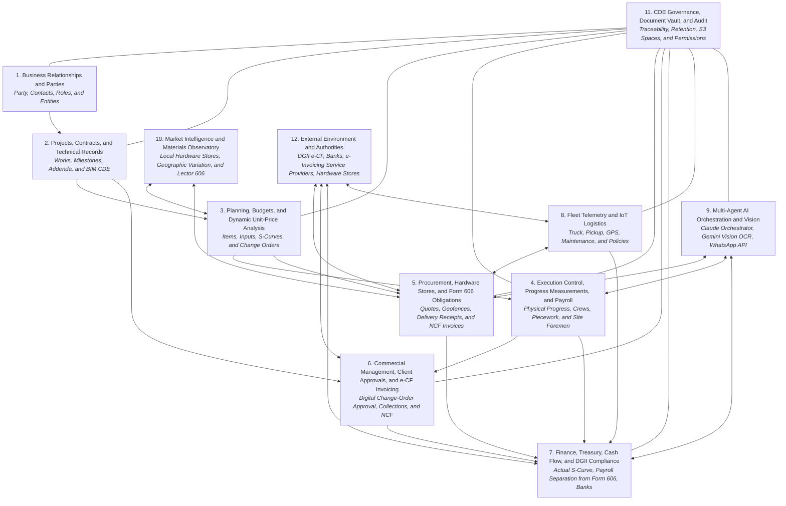

# Business Domain Map — CDE Constructora Angote SRL

## 1. Overview

**Status:** Architectural Definition Document and Business Domain Map for the **Unified Common Data Environment (CDE)** and **Modular ERP** of **Constructora Angote SRL**.
These areas define semantic boundaries for the Dominican construction business, data governance, and authority flows; they are not merely menus or isolated tables.



---

## 2. Business Areas Calibrated for Constructora Angote SRL

### 2.1. Business Relationships and Parties (*Business Relationships*)
- **Purpose:** A unique and persistent record of the legal, tax, and operational identity of every entity or organization that interacts with Constructora Angote SRL.
- **Key Concepts:** Party, natural person, legal entity, RNC / national ID, contact point, business role (client, subcontractor, materials supplier, permanent employee, day laborer, driver, partner), relationship history, and operational rating. Parties must be understood in terms of their hierarchical and decision-making relationships within the organization. For example, the relationship between the senior engineer, field engineer, architect, and site foreman may be vertical in some cases and horizontal in others; these roles may also relate to suppliers, such as a site foreman working with a block and sand supplier.
- **Inviolable Rule:** Each legal entity or natural person has one master record in the CDE, but may hold multiple dated, non-exclusive roles (e.g., a partner who also acts as a contractor or equipment supplier).

#### Parties, Roles, Access Profiles, and CDE Users

In the CDE, a **Party** is a natural person or organization identified in the master registry. A **role** describes the responsibility that a Party assumes within a relationship, project, or work and may change over time. A **user** is an authenticated identity that accesses the platform and may have one or more access profiles. A **profile** groups functional permissions. Permissions are assigned according to need and scope, not nominal job title. **Inputs** are cataloged resources, not Parties, although each supplier of those inputs is a Party.

**Identified parties and roles:**
- **CEO / General Management:** Sets direction, priorities, and resource allocation; makes or delegates investment and scope decisions and approves executive matters within their authority. In the CDE, reviews indicators and authorizes decisions reserved for Management.
- **Client / Developer:** The Party that commissions or funds the project. Reviews deliverables and progress, submits comments, and approves budgets, changes, certifications, or other milestones when stipulated by contract.
- **Suppliers / Vendors:** Persons or organizations that quote or supply materials, equipment, or services. They receive requests, submit offers, and provide commercial documents; their access is limited to their own processes and documents.
- **Inputs:** Materials, consumable equipment, labor, and other resources used or costed in the project. They are cataloged with unit of measure, specification, price, and source, and linked to suppliers, APUs, budgets, requisitions, orders, and receipts. They are not users or Parties.
- **Company Administrator:** Coordinates administrative processes, documentation, and delegated operational authorizations. Maintains files and supporting records; does not replace technical approval or financial authorization reserved for other owners.
- **Accounting:** Classifies and reviews tax receipts, obligations, withholdings, and tax records; prepares Forms 606/607 and reconciliations for review and filing in accordance with the company's legal responsibilities.
- **Human Resources:** Maintains employee records, contracts, positions, onboarding/offboarding, training, and payroll data with restricted access. Coordinates training and induction evidence with HSEQ without exposing employee data to unauthorized users.
- **Attorneys / Legal Counsel:** Reviews contracts, addenda, claims, obligations, permits, and legal risks; issues comments and opinions. Does not independently approve technical changes or payments.
- **Engineer (General):** A technical professional assigned to a project discipline or function. The CDE records their specialty, responsibility, project, deliverables, and review or approval authority.
- **Budgeting / Cost Department Engineer:** Structures line items, quantities, APUs, budgets, and variance analyses; documents sources, assumptions, and versions, and submits baselines and changes for approval.
- **Engineer in Residence:** The technical and operational owner of one or more work fronts. Records the site log, quantities, resources, incidents, and evidence; inspects work and recommends or validates progress measurements within the authority matrix.
- **Senior Engineer / Lead Engineer:** Provides technical oversight, reviews deliverables and deviations, and escalates decisions. Approves only matters formally assigned to their authority level.
- **Structural Engineer:** Develops and reviews structural calculations, design reports, specifications, and drawings; responds to technical queries and assesses the impact of changes within the discipline.
- **Plumbing / Sanitary Engineer:** Develops and reviews potable-water, wastewater, and drainage designs, reports, specifications, and drawings; coordinates interfaces and responds to discipline-specific queries.
- **Electrical Engineer:** Develops and reviews electrical designs, reports, specifications, and drawings; coordinates interfaces and responds to discipline-specific queries.
- **Junior Engineer:** Supports surveys, calculations, drawings, inspections, and document updates under review by the responsible professional. Does not issue approvals reserved for an authorized reviewer.
- **Architect:** Develops and coordinates architectural design, drawings, specifications, and responses to discipline-specific queries.
- **Senior Architect:** Leads or reviews architectural solutions, interdisciplinary coordination, and compliance with design criteria; records assigned comments and approvals.
- **Decorators:** Propose finishes, furnishings, and decorative elements within the approved scope. Their selections remain proposals until approved and incorporated into authorized documents or budgets.
- **Interior Designers:** Develop interior layouts, finishes, furnishings, lighting, and interior documentation; coordinate decisions with architecture and technical disciplines.
- **Landscape Architect:** Designs outdoor spaces, plantings, irrigation, and landscape finishes; coordinates utilities and drainage and delivers drawings and maintenance criteria.
- **Contractors:** Persons or organizations directly contracted to execute a defined scope. Review authorized documents, record deliverables and evidence, and submit progress measurements or requests under their contract.
- **Subcontractors:** Parties contracted by a contractor or by the company for a defined work package. Their contractual relationship and principal owner must be recorded; access is limited to their assigned scope, work front, and documents.
- **Site Foreman / Supervisor:** Coordinates crews, daily sequences, materials, and tools in the field; reports resources, production, and incidents to the Engineer in Residence. Does not independently certify work or authorize payments unless expressly delegated.
- **Employees:** People employed by the company, with their position, unit, project if applicable, supervisor, and employment period recorded. Employment does not automatically grant CDE access.
- **Drivers:** Employees or vendors responsible for driving and delivering materials or equipment. Record trips, deliveries, delivery receipts, and fleet incidents according to their permissions; access only the operational information they need.
- **Workers / Operators:** Personnel performing skilled or general construction work. Attendance, activity, safety, and production records may be submitted through a supervisor or authorized interface; they do not receive access to contractual or financial information by default.
- **Laborers / Helpers:** Personnel supporting crews. Their assignment, attendance, training, and supervision are recorded, with access limited to their own tasks when required by the platform.
- **Supervisors:** Review compliance with scope, methods, quality, safety, and progress within their assigned area. Record inspections and findings; a recommendation is not equivalent to contractual or financial approval.
- **Inspectors:** Perform technical, HSEQ, or quality verifications using checklists, results, and evidence. Their authority to accept, reject, or release an activity depends on their appointment and the approval matrix.

**Additional roles required for the workflow:**
- **Project Director / Project Manager:** Integrates scope, cost, schedule, risks, and owners; coordinates decisions across domains and escalates matters beyond their authority to Management.
- **Planner / Scheduler:** Maintains the WBS, dependencies, milestones, baseline, and schedule updates; analyzes deviations without recording financial transactions.
- **BIM Coordinator / Information Manager:** Manages federated models, discipline coordination, clash issues, naming conventions, and information states; does not replace design approval by each discipline's authorized professional.
- **HSEQ Lead:** Maintains risk matrices, inductions, work permits, inspections, incidents, corrective actions, and applicable environmental and quality evidence.
- **Quality / Laboratory Lead:** Manages inspection and test plans, samples, results, nonconformances, and technical releases within their competence and accreditation.
- **Procurement Lead / Buyer:** Manages requisitions, requests for quotation, comparisons, orders, and supplier follow-up, in accordance with budgets, approval levels, and segregation of duties.
- **Storekeeper / Warehouse Manager:** Records receipt, inspection, location, issue, return, and inventory of materials and tools, linking them to the project, work, and cost center.
- **Cost Controller / Cost Analyst:** Compares budget, commitments, incurred costs, and actual costs; prepares alerts and variance analyses for review by responsible owners.
- **Treasury:** Schedules and records authorized collections and disbursements, reconciles bank transactions, and attaches supporting evidence; does not independently approve the technical or tax support underlying a payment.
- **CDE Administrator / Information Security:** Manages accounts, profiles, permissions, onboarding/offboarding, configuration, and technical audit. Administration of the platform does not automatically grant authority to approve contracts, progress measurements, or payments.
- **Client Representative / External Supervision:** Reviews deliverables and certifications on the client's behalf under the contract, records comments, and exercises only delegated approvals.
- **External Consultants and Specialists:** Geotechnical engineers, surveyors, laboratories, MEP specialists, environmental specialists, and others. Deliver studies and reviews within their scope, with authorship, credentials, and validity documented.
- **Authorities and Regulatory Agencies:** MIVED, municipal governments, MOPC, MITUR, the Ministry of Environment, and other competent agencies. They are recorded as external entities, and their applications, communications, and resolutions are archived; they are not represented as internal users, and direct integration with their systems is not assumed.
- **Financial Institutions and PSFE:** Banks and electronic invoicing service providers participate through accounts, receipts, statements, or service responses. They are managed as external counterparties or integrations, not as internal approvers.
- **Independent Auditor / Reviewer:** Reviews evidence and records within the authorized scope and documents findings. Access is read-only unless a different assignment is expressly authorized.

**Direct and indirect workflow participants:**
- **Direct (internal):** General Management, project management, technical and design staff, the Engineer in Residence and field team, HSEQ and Quality, Procurement and Warehouse, Administration, Accounting, Treasury, Human Resources, and CDE technical administration. They are assigned to a unit, process, project, or work and are accountable for recording, reviewing, or approving internal activities according to their functions.
- **Indirect (external):** Clients and their representatives; contractors, subcontractors, and suppliers; consultants, laboratories, and external inspectors; legal counsel; auditors; authorities; banks; and PSFEs. They participate through deliverables, comments, applications, invoices, certifications, or external services. They receive CDE accounts only when they need to operate in the platform and are authorized to do so; other communications and documents are recorded as evidence without creating unnecessary user accounts.

**Access profiles and participants:**
- **Executive Profile:** General Management; cross-project visibility and approval of assigned executive decisions.
- **Project Management Profile:** Project Director / Manager; manages project information and coordinates delegated reviews and approvals.
- **Technical and BIM Profile:** Engineers, architects, and BIM Coordinator; create or review documents in their disciplines and access the necessary interfaces.
- **Field Profile:** Engineer in Residence, supervisors, foremen, and authorized personnel; record the site log, progress, resources, inspections, and incidents for assigned work fronts.
- **HSEQ and Quality Profile:** Authorized leads and inspectors; manage applicable controls, tests, findings, and closeout.
- **Procurement and Warehouse Profile:** Buyers and storekeepers; process authorized requisitions, quotations, orders, and inventory movements.
- **Finance and Accounting Profile:** Administration, Accounting, and Treasury; review supporting records, record obligations, prepare reports, and execute previously authorized payments under segregation of duties.
- **Legal and Human Resources Profile:** Access to contracts or employee records according to scope, with confidential data restricted and no general access to other projects.
- **Client / Contractor / Supplier Profile:** External access limited to the user's projects, contracts, deliverables, requests, and shared documents.
- **Auditor / Read-Only Profile:** Read-only access to authorized records and evidence, with no editing or approval rights.
- **CDE Technical Administration Profile:** Manages platform identities, permissions, configuration, and audit; must not self-assign business approval authority.

**Assignment rules:** Each user must correspond to a verifiable individual identity; shared accounts prevent attribution and must be avoided. An account is activated by invitation and linked to a Party when applicable, with the organization, role, project/work, supervisor, validity period, and authorized profile recorded. External users receive limited, revocable access. Approvals are associated with the person, date, item, and approved version. Where practicable, the person preparing a transaction must not be its sole reviewer and approver; exceptions require documented delegation. When a user leaves or changes roles, access is revoked or adjusted without deleting the audit history.

**Identity and authority distinction:** Being a Party, holding a job title, having an account, or being listed as a task owner does not by itself confer approval authority. Authority is determined by the contract, current delegation, and project approval matrix; each person may approve only within their assigned scope.

### 2.2. Projects, Contracts, and Technical Records (*Projects, Contracts & BIM CDE*)
- **Purpose:** Defines the legal, geographic, temporal, and technical boundaries of each construction intervention ("Catalina," "Torre Romana," "Angamos Residence," etc.).
- **Key Concepts:** Project, main contract, site/location, cost center, contractual addenda, digital BIM model (IFC / Revit / 3D viewer), approved drawings, technical specifications, and digital site log.

**Project:** A project is an entity with its own lifecycle, developed over a defined period and with a defined budget and objectives. It is the smallest unit of record in the system; every record in the system must be associated with a project. Each project also has a cost center and an assigned owner, which in turn relate hierarchically to other business parties, such as the senior engineer, field engineer, architect, and site foreman. A project may contain several works, and each work may have several cost centers and assigned owners according to role, category, or discipline.

__What a project comprises__: Conceptual planning; design; 2D drawings and the BIM model (IFC / Revit, Archicad, SketchUp / 3D viewer) across architectural, structural, MEP, and other disciplines; the base budget and change orders (addenda); works; procurement; contracts and legal matters; studies and analyses (soil, topographic, hydrological, etc.); landscaping and gardening; cost and expense control centers (payments, progress measurements, purchases, etc.); schedules and milestones; financial planning (accounting and cash flow); the digital site log (activities, physical progress, resources, personnel, equipment, materials, etc.); site telemetry and IoT sensors; sustainability assessments; the analytics layer (S-curves, earned value management, CPI, SPI, CV, SV, BAC, EAC, and variance analysis); change management; project closeout; post-project evaluation and lessons learned (used to improve processes, tools, and technologies and increase the quality, efficiency, productivity, safety, and sustainability of future projects); **HSEQ (Health, Safety, Environment, and Quality)** management; and applicable **legal permitting** (MIVED, municipal governments, MOPC, MITUR, the Ministry of Environment, and other competent agencies, depending on project scope and location).

#### Detailed Breakdown and Operational Boundaries of Project Concepts

1. **Conceptual Planning (*Conceptual Planning*):**
   - **Definition and Scope:** The early strategic phase in which the technical, commercial, legal, and financial feasibility of the construction intervention is formulated, or of a design-only project or consultancy. It establishes the project charter, Constructora Angote SRL's economic profitability objectives, the client/developer profile, the site's development potential, and preliminary urban zoning.
   - **CDE Components:** Pre-feasibility study, architectural intent statement, parametric order-of-magnitude estimate (preliminary cost per m² or unit with an ROM accuracy range of ±20–30%), analysis of environmental constraints, and a tentative high-level milestone schedule.
   - **Boundaries:** It does not contain construction-ready detailed drawings, field quantity measurements, or contractual unit-price analyses (APUs). It ends with the management Go / No-Go decision authorizing formal design and the commissioning of soil and topographic studies.

2. **Design (*Multidisciplinary Architectural & Engineering Design*):**
   - **Definition and Scope:** The technical development, rigorous calculation, and regulatory substantiation that translate the concept into viable construction solutions. It coordinates all engineering and architecture disciplines under the regulatory framework of the country where the project is developed. In the Dominican Republic, this includes **MIVED** (Construction One-Stop Shop - VUC) and the new **Dominican Republic Construction Code (CDCRD 2026, Volumes I–V)**—which updates and replaces the former R-033, R-001, and R-series regulations under international ACI 318 and ASCE 7-22 standards for seismic and wind design—as well as applicable plumbing and electrical codes.
   - **Integrated Disciplines:** Architecture; structural engineering (reinforced concrete, steel sections, foundations); plumbing and sanitation (potable water, wastewater, and stormwater drainage); electrical systems (medium- and low-voltage service, load panels, lighting, and power); HVAC; special systems (fire protection, voice and data, security, access control); and landscaping.
   - **CDE Components:** Structural calculation reports, load-design narratives, plumbing and ventilation reports, technical material specifications, and equipment requirements and data sheets.
   - **Boundaries:** Design provides the technical and mathematical basis for calculations. It is distinct from *Drawings* (the formal graphic and contractual deliverable) and from the *BIM Model* (the interactive parametric three-dimensional representation). Its initial phase concludes when technical reports are frozen and approved for submission. However, design does not cease to be relevant: design records must remain accessible for permitting and change management. For example, if a concrete specification must be changed during construction, the design report must be available to assess structural implications and ensure project safety.

3. **Drawings (*Drawings, Blueprints & Technical Records*):**
   - **Definition and Scope:** Standardized and coded two-dimensional graphic representations that formally communicate design solutions. Drawings are contractual and legal documents that guide on-site construction and support official licenses before the authorities in each country. In the Dominican Republic, these may include MIVED, municipal governments, the Ministry of Environment, CODIA, the Fire Department, and the Ministry of Tourism, among others.
   - **CDE Lifecycle and States:** *Schematic Design*, *Drawings for Municipal/Government Submissions*, *Issued for Construction (IFC)*, *Shop Drawings*, and *As-Built Drawings*.
   - **CDE Components:** Standard title block using Angote / ISO 19650 coding (`[Project]-[Discipline]-[Level]-[Type]-[Revision]`, etc.); seals and signatures of engineers/architects registered with CODIA in the Dominican Republic or the equivalent accredited body in the project's country; institutional approval seals; floor plans, elevations, longitudinal and cross sections (PDF or DWG); construction details; finish schedules; rebar bending schedules; and door and window schedules.
   - **Boundaries:** A drawing is a dated, frozen legal deliverable. In Angote's CDE it is displayed directly in the in-app viewer (S3 Vault), without requiring local downloads unless requested by the user. Field changes must not be marked up manually on paper; they require an RFI (*Request for Information*) and a formal document revision (Rev 0 -> Rev A -> Rev B).

4. **BIM Model (IFC / Revit / 3D Viewer):**
   - **Definition and Scope:** A BIM model is a three-dimensional representation of the building and may serve as a three-dimensional digital twin: a federated, parametric model that consolidates the geometry, physical properties, and metadata of each discipline (architectural, structural, MEP, etc.) in a single spatial database. It enables technical coordination before construction and interactive navigation for supervisors and clients.
   - **Levels of Development (LOD):** From LOD 200 (approximate massing and components), through LOD 300/350 (precise dimensions, mechanical interfaces, structural reinforcement, and coordinated pipe routing), to LOD 400 (fabrication and assembly) and LOD 500 (*As-Built* for operations and maintenance).
   - **CDE Components:** Automated spatial clash detection (e.g., between beams, slabs, and MEP ducts); automated geometric quantity takeoffs (concrete volumes in m³, formwork areas in m², rebar weight in kg/tonnes, and pipe lengths in linear meters); and a web-based 3D viewer with open IFC and Revit model compatibility.
   - **Boundaries:** The BIM model does not replace the contract, budget, or cost analysis (APU); it is the unified source of geometric truth. It is not merely a rendering model but a three-dimensional database that informs theoretical quantity takeoffs and allows comparison with actual physical progress reported in the site log.

5. **Base Budget and Change Orders (Addenda):**
   - **Definition and Scope:** The priced structure of the project's direct and indirect costs, organized hierarchically into chapters, line items, sub-items, and individual inputs through unit-price analyses (APUs). The system strictly separates the following:
     - *Approved Base Budget:* The initial contractual financial baseline agreed and signed by the client/developer.
     - *Change-Order Budget (Addenda):* Changes in scope, quantity increases, extra work, or specification changes requested by the client or resulting from technical contingencies and unforeseen conditions not included in the original conditions, contracts, or assessments.
   - **CDE Components:** Direct costs (materials, inputs, specialized labor and helpers, equipment, subcontractors, associated costs, and temporary operating costs such as site offices and portable restrooms); indirect costs (administration, technical management, site overhead, contingencies, company profit, insurance, and TSS social contributions); contractual selling price; a global APU library with source project and date; and the change-order approval workflow (*Draft*, *Submitted*, *Under Review*, *Digitally Approved by Client*, *Rejected*).
   - **Boundaries:** **Angote Inviolable Rule:** The Base Budget is the project's immutable baseline and must never be overwritten when changes arise. Each addendum is added separately, with its own APU and approved unit prices, preventing original contractual commitments from being mixed with pending or approved variations.

   **5.2 Cost Analysis or Unit-Price Analysis (APU)**
   - **Definition and Scope:** A unit-price analysis (APU) determines the estimated cost of executing one unit of a line item, according to its specifications, location, site conditions, and calculation date. It supports budget valuation and resource estimates without replacing quantity measurement or contractual approval. Examples include the cost of 1 m³ of beam, column, or slab concrete; 1 m² of plastering or skim coating; installing 1 m² of 6-inch or 8-inch concrete blocks; or 1 linear meter of a given pipe. It analyzes the unit or overall cost of producing a line item by assessing associated labor and input costs, required quantities, and the applicable measurement method (linear meter, m², m³, board foot, piece, etc.).
   - **Analysis Components:** Materials and inputs, including consumption quantities, waste, and prices; labor by category, crew, productivity, and applicable burdens; equipment and tools according to usage time, productivity, and associated costs; and indirect costs or supplementary charges under Angote's methodology. The analysis identifies the payment unit, resource cost, subtotals, and resulting unit price, and states its criteria and assumptions. **APUs will use inputs from the CDE database, and labor costs will be associated with references in the database.**
   - **Traceability and Control:** Each cost analysis or APU retains its source project and line item, unit of measure, date and price source, productivity assumptions, author, version, and approval status. APUs may be reused as references from the global library, but any adaptation creates an identifiable version and does not modify approved analyses. Scope or price variations that affect contractual commitments are managed through the relevant change-order budget; they do not alter the approved baseline.

6. **Works (*Physical Execution Fronts & Intervention Sites*):**
   - **Definition and Scope:** A physical, spatial, or phased subdivision within a project. It represents an operational work front where resources, crews, and machinery are concentrated. For example, works within the "Catalina" project may include "Villas," "Tower 1," "Tower 2," "Clubhouse and Social Areas," "Road and Utility Infrastructure," or "Schools." In short, a work is the physical execution of a project: the on-site realization of what is established in the BIM model or approved drawings, including construction, remodeling, additions, and similar interventions.
   - **CDE Components:** A unique work identifier subordinate to the Project ID; a specific map geofence; the engineer in residence / field engineer responsible for the front; secondary cost centers by category or discipline; a local field warehouse; and a list of active crews.
   - **Boundaries:** A Work is not an independent Project; it has no separate legal or contractual status with the end client. It defines a geographic and operational area in the field so contingencies or deviations in one front do not distort analysis of other project fronts.

7. **Procurement and Contractor Selection (*Procurement, Sourcing & Subcontractor Onboarding*):**
   - **Definition and Scope:** The technical-commercial and due-diligence process through which Constructora Angote SRL tenders, evaluates, negotiates, and selects subcontractors, specialist service providers, and crews to execute work packages.
   - **CDE Components:** Work packages (*Scope of Work* / Terms of Reference), technical specifications, receipt and comparison of quotations, technical and financial evaluation matrix, legal and reputational due diligence for the Party in the master record, and historical quality ratings from previous Angote SRL projects.
   - **Boundaries:** This area covers the pre-contractual selection and negotiation phase and ends with the formal award; formal legal contracting follows. No subcontractor or site foreman may be assigned to a work front without completing this process.

8. **Contracts (Legal) (*Legal Contracts, Bonds & Guarantees*):**
   - **Definition and Scope:** Formal, legalized, and binding legal instruments governing rights, duties, penalties, warranties, deadlines, and payment terms between Constructora Angote SRL and its business parties:
     - *Main Construction Contract:* Entered into with the client/developer. It defines the project's general terms and boundaries, scope, duration and milestones, payment terms (whether payments are based on progress measurements or a cash flow with fixed dates), penalties and their limits for unmet obligations by either party, and exceptions to penalties—in short, the project's overall terms, payment conditions, and schedule.
     - *Construction and Service Subcontracts:* Entered into with specialist companies (MEP installations, steel structures, windows, etc.).
     - *Service / Piecework Labor Contracts:* Entered into with qualified site foremen or crew leaders.
     - *Formal Contractual Addenda:* Legal documents supporting approved changes to amounts or extensions of time.
     - *Technical Staff Employment Contracts:* Legal documents for the direct employment of technical personnel by the company.
     - *Office and Administrative Staff Employment Contracts:* Legal documents for hiring administrative and office staff (administrators, accountants, secretaries, office engineers, architects, site engineers, and all personnel working within administration and human resources, including permanent or long-term temporary company staff with roles and positions defined by hierarchy, project, and status within the organization).
   - **CDE Components:** Scope and specification clauses; payment schedule and progress-measurement conditions; retainage (typically 5% to 10%); performance bonds; liability insurance; latent-defect insurance (ten-year liability under Article 1792 of the Dominican Civil Code); termination grounds; delay penalties attributable to the responsible party; and an immutable S3 Vault repository with signature traceability.
   - **Boundaries:** The contract establishes the legally enforceable framework and risk governance; it is distinct from an operational Purchase Order and from a physical progress measurement. The progress measurement certifies the quantity completed; the contract determines when, subject to which retainage and within what legal time limits, payment is due.

9. **Cost and Expense Control Centers (Payments, Progress Measurements, Purchases, etc.):**
   - **Definition and Scope:** An analytical and budgetary structure that classifies, allocates, and controls each project transaction throughout its lifecycle across three financial states: *Committed* (awarded contracts and purchase orders), *Incurred* (approved physical or digital progress measurements or received formal invoices with NCF), and *Disbursed* (payments, executed bank transfers, and checks), supporting cost tracking against project budget items.
   - **CDE Components:** Structured cost-center code (`[PROJECT_ID]-[WORK_ID]-[DISCIPLINE/LINE_ITEM]`); expense categories (direct labor, inputs/materials, equipment and fuel, subcontractors, indirect costs); role-based authorization matrix (Field Engineer -> Senior Engineer -> Central Administration); three-way match workflow (*Three-Way Match*: Requisition -> Delivery Receipt / Progress Measurement -> NCF Invoice -> Payment); and real-time budget balance.
   - **Boundaries:** A Cost Center is not a treasury bank account; it is an analytical allocation and control account associated with project costs and used for ongoing project analysis. Overspending indicates a loss, while underspending is not automatically positive and may signal a quality imbalance in Angote's services. Any overrun at or above the associated line-item cost and any saving of 20% or more against the associated line item must be reviewed. **Inviolable Rule:** No disbursement, purchase order, or progress measurement may exist in the CDE without an unambiguous link to a Project and an active Cost Center with an assigned owner, except duly authorized corporate administrative and fleet expenses.

10. **Schedules and Milestones (*Schedules, WBS & Milestones*):**
    - **Definition and Scope:** Modeling and control of the project's time dimension, structured around the Work Breakdown Structure (WBS). It determines the logical sequence of activities, calculates operational durations from APU productivity rates, identifies the Critical Path Method (CPM) path, and sets non-negotiable contractual milestones for each project, work, remodel, addition, etc.
    - **CDE Components:** Interactive Gantt chart with logical dependencies (Start-to-Start, Finish-to-Start, etc.); free and total float by task; frozen time baseline (*Baseline Schedule*); key control milestones (e.g., "Foundation Complete," "Level 4 Structure Poured," "Facade Closure," "Provisional Handover"); and, where implemented, connections to multi-agent AI and predictive models for preventive alerts to subcontractors via WhatsApp, email, and voice calls. For BIM and non-BIM projects, AI may generate a draft schedule from budget items, crew and personnel productivity data, and/or the BIM model. It proposes a structure, estimated dates, and a recommended critical path for human review. This is a structured, rules-based process, not an ungrounded generative output: project documents pass through ETL, data-frame processing, descriptive analysis, forecasting, clustering, and prescription to inform the models. This applies to project information, budgets, BIM models, and drawings; BIM models and drawings may also be represented as graphs for AI assistant use.
    - **Boundaries:** This area models and manages time and execution pace. It does not itself record disbursements. It may produce schedule drafts for human approval and provide the basis for schedule performance and variance analysis; financial planning and the S-curve remain within Financial Planning.

11. **Financial Planning (Accounting and Cash Flow):**
    - **Definition and Scope:** Dynamic forecasting, liquidity governance, and reconciliation of cash flows that support the project's operational health throughout its lifecycle. It integrates projected versus actual cash flow, commercial collections, and tax compliance with the Dominican Internal Revenue Service (DGII).
    - **CDE Components:** Planned outflow curve versus actual disbursements; weekly and monthly operating cash flow; Accounts Receivable (AR - clients) and Accounts Payable (AP - suppliers and subcontractors) calendars; working capital required by construction phase; tax-withholding provisions (ISR, ITBIS); and Social Security contributions (TSS).
    - **Boundaries:** **Absolute Accounting Separation:** The financial module strictly separates administrative payroll from project payroll, progress measurements, and field wages (site foremen and pieceworkers), as well as from purchases and services supported by NCF/e-CF tax receipts (Form 606), to prevent tax inconsistencies. The Base Budget states *how much* the entire work will cost; Financial Planning determines *when* and *with what liquid funds* each phase will be financed.

12. **Digital Site Log (Activities, Physical Progress, Resources, Personnel, Equipment, Materials, etc.):**
    - **Definition and Scope:** The official, chronological, immutable, georeferenced record of daily activity at each work front. It is the evidentiary source of field events (*Ground Truth*) that technically supports actual physical progress before any payment is authorized or any progress measurement is issued to a client or subcontractor.
    - **CDE Components and Daily Records:**
      - *Environmental Conditions:* Weather, precipitation, and ground conditions (legal evidence supporting extensions of time due to force majeure).
      - *Personnel and Labor:* Daily headcount by crew and specialty (rebar workers, masons, carpenters, plumbers, electricians, helpers); hours worked; discipline or safety incidents; and the responsible site foreman.
      - *Equipment and Machinery:* Active equipment (heavy truck, pickup, tower cranes, concrete mixers, generators); effective engine hours; idle time; and fuel supply.
      - *Material Receipt and Control:* Delivery receipts and materials received on site (ready-mix concrete, rebar, aggregates, concrete blocks), with confirmation of receipt signatures.
      - *Physical Progress and Completed Activities:* Specific tasks completed by line item, level, and structural grid; concrete pours with cylinder testing and laboratory results.
      - *Photographic and Multimodal Evidence:* Immutable photographs watermarked with date, time, and GPS location; field audio processed by the AI engine (via WhatsApp / Plaud / the app); and technical instructions from the Engineer in Residence.
    - **Boundaries:** The site log is an empirical and testimonial record, not a payment or accounting document. It is a mandatory prerequisite: the Engineer in Residence and Senior Engineer may not approve construction progress measurements without it.

13. **Analytics Layer (Data Science & Data Analysis: S-Curves, Earned Value, CPI, SPI, CV, SV, BAC, EAC, and Variance Analysis):**
    - **Definition and Scope:** A business-intelligence, management-control, and predictive-diagnosis engine that continuously combines Schedule (Time), APU Budget (Cost), and Site Log progress measurements (Actual Scope Completed) using the international Earned Value Management (EVM) methodology. It supports early detection of deviations and forecasts final cost and completion date before financial losses occur.
    - **Metrics and Intelligence Components:**
      - **S-Curves:** Dynamic cumulative chart comparing Planned Value (*PV* / Planned S-Curve), Actual Cost (*AC* / incurred costs), and Earned Value (*EV* / certified physical work valued at budgeted rates).
      - **BAC (*Budget at Completion*):** Total approved base budget plus approved addenda; the final budgeted project cost.
      - **PV (*Planned Value*):** Budgeted value of work scheduled to have been completed by the status date.
      - **EV (*Earned Value*):** Budgeted value of work actually completed, measured, and approved in the field.
      - **AC (*Actual Cost*):** Actual incurred cost of performing the work represented by EV.
      - **CV (*Cost Variance*) & SV (*Schedule Variance*):** Cost variance (`CV = EV - AC`) and schedule variance (`SV = EV - PV`). A positive value indicates cost underrun or schedule lead; a negative value indicates cost overrun or delay.
      - **CPI (*Cost Performance Index*) & SPI (*Schedule Performance Index*):** Efficiency indices (`CPI = EV / AC`, `SPI = EV / PV`). Values above 1.0 indicate favorable cost or schedule performance; values below 1.0 flag performance issues requiring prompt review.
      - **EAC (*Estimate at Completion*):** Forecast final project cost based on the observed trend (`EAC = BAC / CPI`).
      - **Variance Analysis:** Line-item and discipline-level diagnosis isolating the root causes of discrepancies (e.g., increases in hardware-store material prices versus low field labor productivity) to guide corrective action by the Senior Engineer.
    - **Boundaries:** The analytics layer does not create primary purchase or contract transactions. It is the executive-level dashboard for oversight, predictive visualization, and strategic control of the construction company.

14. **Preliminary Technical Studies and Analyses (*Preliminary Technical Studies & Ground Investigation*):**
    - **Definition and Scope:** Scientific investigations, field tests, and geotechnical, topographic, geophysical, and hydrological assessments that characterize the site and its surroundings before structural design and excavation. They provide the mathematical and geomechanical basis required under the **Dominican Republic Construction Code (CDCRD 2026, Volumes I–V)** and ASTM/ACI standards to ensure building stability, seismic resistance, and safety.
    - **Disciplines and Studies:**
      - *Geotechnical / Soil Mechanics Study:* SPT (*Standard Penetration Test*), open-pit test pits, rotary borings with core recovery, allowable bearing capacity ($q_{adm}$ in kg/cm² or ton/m²), modulus of subgrade reaction, stratigraphy, groundwater depth, seismic liquefaction potential, and foundation recommendations (isolated footings, mat foundation, piles, or ground improvement).
      - *Topographic and Elevation Survey:* Georeferenced planimetric and elevation survey using a total station and drones (RTK photogrammetry); standardized contour intervals; cadastral boundaries under the Dominican Republic's Land Registry (JI); perimeter markers; easements; and adjacent road grades.
      - *Hydrological and Hydrographic Study:* Watershed and runoff analysis; flood levels for return periods ($Tr = 25, 50, 100$ years); soil infiltration capacity; and primary stormwater drainage or infiltration-well design.
      - *Preliminary Environmental Impact Study:* Identification of environmental liabilities, protected flora, and environmental authorization requirements before the Ministry of Environment and Natural Resources (Law 64-00).
    - **CDE Components:** Geotechnical reports signed and sealed by geotechnical engineers and accredited laboratories in immutable PDF format (S3 Vault); point clouds and contour files in DWG/LandXML for import into the digital BIM model / Civil 3D; and tabulated geotechnical parameters accessible to the structural engineer in the design reports.
    - **Boundaries:** Technical studies represent the physical truth of the site; they do not replace structural calculations or construction drawings but are a prerequisite for their preparation. Any discrepancy between preliminary borings and the soil encountered during clearing or earthworks requires a geotechnical confirmation protocol before the blinding concrete pour is authorized.

15. **Landscape Architecture and Gardening (*Landscape Architecture, Hardscape & Green Integration*):**
    - **Definition and Scope:** The architectural and ecological discipline that designs, builds, and maintains open outdoor spaces, green terraces, perimeter gardens, and hardscape features (walkways, pavers, pergolas, reflecting pools) integrated into the project. It supports bioclimatic comfort and property value and meets municipal requirements for minimum permeable green areas.
    - **CDE Components:**
      - *Plant Catalog and Species:* Selection of native or climate-adapted plants for the Dominican Republic (low-water xerophytic or tropical species, salt tolerance in coastal areas such as La Romana or Punta Cana, and hurricane-wind tolerance).
      - *Irrigation Systems:* Plans and specifications for automated irrigation (drip, micro-sprinklers, or emitters controlled by solenoid valves and moisture sensors).
      - *Landscape and Exterior Lighting:* Independent low-energy electrical circuits (solar or IP65/IP67 LED fixtures) coordinated with MEP.
      - *Landscape APUs:* Line items for topsoil and enriched substrate, supply and planting of mature trees, palms, shrubs, and turf (such as Zoysia/Bermuda), plus the initial contractual maintenance period and guaranteed irrigation during plant establishment.
    - **Boundaries:** It coordinates directly with exterior plumbing and stormwater drainage to prevent waterlogging and root damage to underground networks and foundations. Contractual deliverables include approved landscape drawings and the maintenance and fertilization manual transferred to the end client.

16. **Sustainability Assessments and Environmental Management (*Sustainability, Circularity & Environmental Compliance*):**
    - **Definition and Scope:** Environmental governance, resource efficiency, and ecological responsibility throughout the project lifecycle. It supports compliance with the Dominican Republic's General Environmental Law (Law 64-00), Ministry of Environment and Natural Resources requirements, and construction sustainability standards (lower carbon footprint, energy efficiency, and responsible water use).
    - **CDE Components:**
      - *Environmental Management and Adaptation Plan (PMAA):* On-site impact mitigation matrix (dust control through water spraying, acoustic barriers, slope protection, and runoff control).
      - *Construction and Demolition Waste (CDW) Management:* Site-log records of the weight or volume of sorted debris (concrete for recycling or fill, scrap steel, reusable timber, and non-recyclable waste) and traceability of disposal at authorized landfills.
      - *Energy Efficiency and Indoor Environmental Quality (IEQ):* Solar orientation, thermal envelope, natural cross-ventilation, and selection of materials with low volatile organic compound (VOC) content.
      - *Water and Electricity Performance Metrics:* Estimated and verified potable-water savings (low-flow fixtures and rainwater harvesting) and provisions for photovoltaic generation or electric-vehicle charging.
    - **Boundaries:** This is not merely a statement of intent; it produces auditable evidence (waste transport manifests, certified wood-origin records, discharge permits). It validates the environmental and social compliance required by financial institutions, trust funds, and developers using ESG (*Environmental, Social, and Governance*) criteria.

17. **Site Telemetry and IoT Sensors (*Site Telemetry, IoT Equipment & Physical Monitoring*):**
    - **Definition and Scope:** Deployment of connected instrumentation, IoT hardware, and telematics devices at work fronts and associated assets. It automates the capture of critical physical measurements, monitors machinery performance and safety in real time, supports real-time PPE checks, and feeds raw field data directly into the CDE Digital Site Log without error-prone manual intervention.
    - **CDE Components and Sensors:**
      - *Concrete Maturity and Curing Sensors:* IoT probes embedded in critical slabs, columns, and beams record internal temperature changes and calculate compressive-strength gain ($f'c$) in real time, supporting safe and timely formwork removal with verifiable parameters.
      - *On-Site Weather Station and Environmental Sensors:* Continuous measurement of ambient temperature, relative humidity, wind gusts, and rainfall (mm/hour). Provides technical evidence to support decisions to stop concrete pours or claims for time extensions due to excessive rain.
      - *Digital Telematics and Hour Meters on Site Machinery:* GPS and OBD-II / CAN-bus interfaces installed on generators, concrete mixers, tower cranes, heavy trucks, and operational pickups. They track effective operating hours versus idle time, fuel consumption per hour/kilometer, and preventive maintenance work orders.
      - *Piezometric and Deformation Sensors:* Groundwater monitoring during deep excavations and inclinometers/deformation sensors on retaining walls or slopes next to neighboring buildings.
    - **Boundaries:** IoT sensors provide objective real-time physical evidence (*Ground Truth*). They do not replace official laboratory compression tests on concrete cylinders required by CODIA/MIVED; they provide continuous interim monitoring to support field-engineer decisions and reduce fraud in machinery-hour and diesel-use reporting.

18. **Change Management (*Change Management & Scope Control*):**
    - **Definition and Scope:** A systematic process and technical governance for identifying, documenting, assessing, approving, or rejecting all requests to modify the project's original scope (*Change Requests*). It protects the project against uncontrolled scope creep and ensures that every technical variation is assessed for cost (APU), time (critical path), and structural-safety impact before approval.
    - **CDE Governance Workflow:**
      1. *Change Request (CR) Registration:* Submitted by the client, supervision, field engineer, or designer and supported by an RFI (*Request for Information*) or formal technical instruction.
      2. *Multidimensional Impact Assessment:* Integrated analysis of additional or deductive cost, schedule impact in days, and BIM model clashes.
      3. *Technical Management Opinion (Raymond):* Technical review and pre-approval.
      4. *Binding Client/Developer Approval:* Express digital approval on the CDE platform using a validation token.
      5. *Contract and Budget Routing:* Once approved, the corresponding **Budget Addendum** and formal contractual addendum are generated.
    - **Boundaries:** **Angote Inviolable Rule:** No verbal instruction on site or hand-marked drawing authorizes execution of a scope change. Until a change request completes the CDE approval cycle, work fronts must not redirect resources or materials to that extra work item.

19. **Project Closeout and Handover (*Project Closure, Commissioning & Handover*):**
    - **Definition and Scope:** The technical, legal, administrative, and financial completion phase. It includes comprehensive verification of completed work against contractual drawings and technical specifications, commissioning of electromechanical systems, identification and correction of minor defects (*Punch List*), and formal transfer of physical and legal custody of the property to the client/developer.
    - **CDE Components:**
      - *Digital Inspection and Punch List:* Geolocated photographic records of finish defects or nonconformances assigned to responsible subcontractors with firm correction and verification deadlines.
      - *Commissioning Tests:* Potable-water pipe pressure tests, roof and terrace water-tightness tests, electrical-panel insulation tests, HVAC airflow balancing, and pressurization tests for stairs and fire pumps, with signed reports.
      - *Provisional and Final Handover Certificates:* Legal instruments formally transferring custody, marking the end of the contractor's custodial responsibility and the start of warranty periods.
      - *As-Built Dossier and Records:* Consolidated As-Built drawings in PDF/DWG, LOD 500 BIM model, technical catalogs, warranties for installed equipment, and the building user and preventive-maintenance manual.
      - *Contractual and Financial Settlement:* Reconciliation of final accounts; balance of paid versus incurred addenda; release of retainage; and issuance of mutual legal release (*Final Settlement*).
    - **Boundaries:** Project closeout ends the active construction phase and formally activates **ten-year liability** (Article 1792 of the Dominican Republic Civil Code) for major latent defects and the corresponding insurance policy.

20. **Post-Project Evaluation and Lessons Learned (*Post-Project Review & Continuous Improvement*):**
    - **Definition and Scope:** A retrospective audit, forensic performance analysis, and organizational knowledge-capture process conducted after each Constructora Angote SRL project closes. It turns field experience into measurable improvements in processes, crew productivity, tools, and technology for future work.
    - **CDE Components:**
      - *Forensic Cost and Schedule Audit:* Rigorous comparison of the Base Budget ($BAC$), actual cost incurred ($AC$), and interim forecasts ($EAC$), identifying unusual losses or overruns and their root causes (subcontractor failures, input-price volatility, or estimating errors).
      - *Historical Supplier and Subcontractor Ratings:* Objective evaluation of each Party in the master record against schedule performance, on-site technical quality, and safety/housekeeping discipline.
      - *Feedback to the Global APU Library:* Automatic or supervised updates to labor productivity (m²/day of plastering, kg/day of rebar installation, etc.) and actual input consumption in Angote SRL's APU database, improving future bid estimates.
      - *Lessons-Learned Repository (Knowledge Base):* Records of incidents, solutions to construction bottlenecks, more efficient materials, and successful innovations for cross-project use by senior engineers and engineers in residence.
    - **Boundaries:** This is not a punitive performance review; it is the company's continuous-improvement (*Kaizen*) engine. Its findings inform the parameters used by AI agents (Claude/Gemini) to review future budgets and schedules.

21. **HSEQ Management (Health, Safety, Environment, and Quality):**
    - **Definition and Scope:** A cross-functional management system that identifies and controls occupational and operational risks, prevents injuries and occupational illnesses, reduces the environmental impacts of construction activities, and verifies that processes and deliverables meet applicable technical and quality requirements.
    - **CDE Components:** HSEQ plan for each project and work; hazard, risk, and impact matrices; inductions and training; personal protective equipment issuance and control; high-risk work permits; inspections and audits; incident and near-miss reports; environmental controls; real-time PPE-use monitoring; work-at-height training; test results and quality inspections; and nonconformance records, corrective actions, and closure evidence.
    - **Boundaries:** HSEQ governs prevention and operational controls during design and construction and retains verifiable evidence of compliance. It coordinates with sustainability and environmental management but does not replace them; nor does it replace permits issued by authorities, the designer's professional responsibility, or technical site supervision.

22. **Legal and Regulatory Permitting (*Permits, Licenses & Regulatory Approvals*):**
    - **Definition and Scope:** Management of the lifecycle of permits, licenses, approvals, and authorizations required to design, build, modify, and hand over each project. It identifies requirements according to location, use, and scope; coordinates preparation and submission of application packages; and tracks review, approval, validity, conditions, and closeout.
    - **CDE Components:** Requirements and permit matrix by project and work; competent agency; owner; submission, response, and expiration dates; submitted drawings and documents with their revisions; application number; status; comments and responses; approved permits or resolutions; associated conditions; inspections and evidence of compliance; renewals; and closeout of the application record.
    - **Boundaries:** This area manages records and follows up on applications before the competent agencies—for example, MIVED, municipal governments, MOPC, MITUR, and the Ministry of Environment, as applicable. CODIA may be involved in professional registration, signatures, or professional validation, but is not itself treated as an authority that issues construction permits. Permitting does not replace internal design approval, HSEQ management, or project contracts.

- **Inviolable Rule:** No purchase order, progress measurement, or payment may exist in the CDE without an unambiguous link to a Project and an active Cost Center with an assigned owner, except office maintenance purchases or work orders, other properly documented items approved by the Senior Engineer, miscellaneous expenses approved by Administration, and maintenance expenses for company vehicles and equipment or other properly documented items approved by Administration. The purpose is to maintain strict control over the company's operating expenses.

### 2.3. Planning, Budgets, and Dynamic Unit-Price Analysis (*Planning, Budgeting & Dynamic APU*)
- **Purpose:** Structured modeling of direct and indirect costs, productivity rates, and investment scheduling before and during construction.
- **Key Concepts:** Line item, sub-item, base input (cement, rebar, concrete, aggregates), unit-price analysis (APU), approved Base Budget, separately tracked change-order budget, planned S-curve, and milestone schedule.
- **Inviolable Rule:** APUs generated in the system are stored in a reusable global library but remain tagged with their source project and quotation date. Every budget change must be added to the project total without overwriting the initial contractual baseline.

### 2.4. Work Execution Control, Progress Measurements, and Site Payroll (*Work Delivery, Field Progress & Site Payroll*)
- **Purpose:** Physical measurement of completed field work, progress certification, and settlement of direct labor.
- **Key Concepts:** Physical progress measurement by line item (% verified on site), piecework/adjustment payroll, daily site payroll, site foreman, crew, photographic inspection, and Engineer in Residence approval.
- **Inviolable Rule:** Progress used to pay a subcontractor or site foreman must be tied to physical inspection of the work item; no funds are released without measurement evidence and technical-supervision approval.

### 2.5. Procurement, Supplier/Hardware Store Management, and Form 606 Obligations (*Procurement & 606 Obligations*)
- **Purpose:** Requesting, comparing quotations, purchasing, receiving on site, and recognizing obligations to formal materials and service suppliers.
- **Key Concepts:** Material requisition, request for quotation, purchase order, delivery receipt / bill of lading, commercial invoice with NCF/e-CF (B01, E31, etc.), hardware-store supplier profile (El Detallista, Ochoa, etc.), and Form 606 tax report.
- **Inviolable Rule:** To recognize a formally deductible cost, the invoice must have a valid DGII NCF/e-CF verified by the system or Gemini vision engine.

### 2.6. Client Commercial Management, Change-Order Approval, and e-CF Invoicing (*Client Commercial & e-CF Invoicing*)
- **Purpose:** Management of the contractual and financial relationship with the project owner or developer.
- **Key Concepts:** Payment model (fixed cash-flow installments versus progress-based billing), budget presentation with B&W brand identity, digital change-order approval button, client progress certificate, electronic sales invoice (e-CF type E31/E32), and client account statement.
- **Inviolable Rule:** No extra work item may generate a client charge or be included in the final schedule until the client has expressly approved it digitally on the platform.

### 2.7. Finance, Treasury, Cash Flow, and DGII Tax Compliance (*Finance, Cash Flow & DGII Compliance*)
- **Purpose:** Cash-flow control, bank reconciliation, disbursement forecasting, settlement, and tax reporting to DGII.
- **Key Concepts:** Projected versus actual cash flow, cumulative investment S-curve, Accounts Payable (suppliers and subcontractors), Accounts Receivable (clients), direct payroll entries (TSS/IR-3), Form 606 tax return (purchases and expenses), and Form 607 (sales).
- **Inviolable Rule:** **Absolute Accounting Separation:** Field payroll disbursements (daily wages and piecework) must never be reported under Form 606 for purchases of goods/services supported by NCF; they must remain in separate accounting modules to avoid tax exposure with DGII.

### 2.8. CDE Governance, Document Vault, and Audit (*CDE Governance, Document Vault & Audit Trail*)
- **Purpose:** Secure cloud document centralization (S3 Spaces), role-based permissions, and an immutable chronological record of actions.
- **Key Concepts:** Digital Vault (DigitalOcean Spaces S3), in-app drawings and document viewer (without forcing downloads), audit log, and automatic generation of contracts, insurance policies, vehicle registrations, and licenses.
- **Inviolable Rule:** Every uploaded document (invoice, drawing, policy, addendum) is immutable; corrections create new versions or adjustment notes with author and date, ensuring legal and accounting traceability.

---

## 3. New Domain Areas Incorporated (Angote SRL Key Differentiators)

### 3.1. Fleet Vehicle Telemetry and Site Logistics (*Fleet Telemetry & IoT Logistics*)
- **Purpose:** Physical management, geographic monitoring, operating-cost control, and preventive maintenance of the company's vehicles (operational pickup and heavy truck).
- **Key Concepts:** Vehicle asset, GPS / telematics device and API, geofences (hardware stores, warehouse, worksites), maintenance log, maintenance cost per kilometer/hour, useful-life depreciation, insurance-policy vault, vehicle registrations, and driver licenses.
- **Business Rules:**
  - Automated preventive alerts (email / WhatsApp and red dashboard indicator) **30 and 15 days** before insurance, registration, or license expiration.
  - Direct allocation of fuel and maintenance costs to the cost centers of the projects served.

### 3.2. Multi-Agent AI Orchestration and Multimodal Capture (*Autonomous AI Multi-Agent & Multimodal Ingestion*)
- **Purpose:** Intelligent automation of operational and field tasks through a central orchestrator (ADK) and specialized agents connected through standard channels (database, analytics layer, inference engine, CDE API, autonomous task execution, WhatsApp, email, and dashboards).
- **Specialized Agents — Examples:**
  1. **Procurement Agent:** Autonomously obtains hardware-store prices through different channels—internet, email, WhatsApp, phone calls, etc.—and may use the heavy truck's GPS location to optimize supply stops along its route.
  2. **Time and Schedule Agent:** Actively follows up with subcontractors by WhatsApp before delivery deadlines, records site-log entries, or escalates bottlenecks to the Engineer in Residence.
  3. **Finance and Audit Agent:** Detects inconsistencies between physical progress measurements and disbursements, monitors APU variations, and flags tax-limit alerts.
  4. **Gemini Artificial Vision Engine (Anti-Hallucination OCR):** Ingests and processes large volumes of photographed paper invoices, with programmed rejection when NCF, RNC, or amounts are ambiguous.

### 3.3. Market Intelligence and Materials Observatory (*Market Data & Material Price Index*)
- **Purpose:** Systematic monitoring of critical construction input prices in the Dominican Republic's main economic hubs (Santo Domingo, Santiago, Punta Cana, and La Romana).
- **Key Concepts:** Price-variation index, three-times-weekly update frequency, standardized hardware-store catalog (El Detallista, Ochoa, etc.), and the future "Lector 606" strategy (a free app with terms and conditions for anonymized aggregation of sector cost data).

---

## 4. Critical Cross-Domain Distinctions to Validate (*Cross-Domain Invariants*)

1. **Party ≠ Operational Role:** A person or company has one RNC/national ID; its roles as client, subcontractor, hardware-store supplier, or partner are contextual, dated relationships.
2. **Project ≠ Contract ≠ Cost Center ≠ Physical Location:** "Angamos Residence" is a project that may have several contracts (civil works, finishes, supervision), several cost centers (Phase 1, addenda), and a specific physical geofence.
3. **Base Budget ≠ Committed Cost ≠ Incurred Obligation ≠ Actual Disbursement:**
   - *Budget:* What was planned through APUs.
   - *Committed:* The issued purchase order or contract.
   - *Incurred:* Approved physical progress measurement or received NCF invoice.
   - *Disbursed:* The actual bank transaction recorded in treasury.
4. **Three Meanings of "Cubicación":**
   - *Subcontractor Progress Measurement:* Field measurement used to settle labor or piecework.
   - *Client Progress Certification:* Physical progress certificate submitted for commercial collection.
   - *Internal Control Measurement:* Comparison against the BIM model and Base Budget to feed the S-curve.
5. **Strict Tax Separation:** Piecework labor or field payroll is never reported on Form 606; Form 606 requires valid tax receipts (e-CF with a registered supplier's RNC/national ID).
6. **Document Authority Levels:**
   - *Level 1 (Raw Evidence):* Invoice photo, Plaud audio, signed delivery receipt.
   - *Level 2 (AI Extraction):* Structured JSON from Gemini Vision or Claude (subject to review).
   - *Level 3 (Approved Business Record):* Invoice/progress measurement validated by the Engineer in Residence or Accountant.
   - *Level 4 (Official Report):* DGII Form 606 TXT file, stamped e-CF electronic invoice, or accounting balance.

---

## 5. Prescriptive Responses to the Initial Review Request (*Initial Review Request*)

### Question 1: Rename or Correct Areas to Match Constructora Angote SRL's Operational Language

| Original Proposed Name (EN) | Calibrated Operational Term (ES - Angote SRL) | Operational Rationale and Dominican Scope |
| :--- | :--- | :--- |
| **Planning and Cost Control** | **Planning, Budgets, and Dynamic APU** | The company manages budgets at the input and APU level (footings, concrete, walls), while strictly separating "Change Orders" through their own approval workflow. |
| **Work Delivery and Capacity** | **Execution Control, Progress Measurements, and Site Payroll** | Incorporates the standard Dominican term `Cubicación` (actual physical progress in %) and segregates direct labor (crews, piecework, site foremen). |
| **Procurement and Supplier Obligations** | **Procurement, Hardware Stores, and Form 606 Obligations** | Reflects daily dealings with local suppliers (El Detallista, Ochoa) and the requirement that every formal purchase be included in tax report 606. |
| **Client Commercial and Billing** | **Client Commercial Management, Change Orders, and e-CF Invoicing** | Emphasizes the two collection models (fixed cash flow versus physical progress measurement), the digital change-order approval button, and issuance of e-CF electronic invoices with B&W brand identity. |
| **Finance, Accounting, and Tax** | **Finance, Treasury, Cash Flow, and DGII Compliance** | Prioritizes two views (executive dashboard and S-curve by line item) and the critical rule separating direct payroll from Form 606 reports. |
| **Governance and Records** | **CDE Governance, Document Vault, and Technical Records** | Defines storage in DigitalOcean Spaces (S3) and in-app viewing of drawings, policies, and contracts without requiring downloads. |

---

### Question 2: Identify Important Areas Missing from the Map

**Four fundamental areas** have been formally identified based on Angote SRL's operational needs:

1. **Fleet Telemetry and IoT Logistics (*Fleet Telemetry & IoT Logistics*):**
   - Active management of the operational pickup and heavy truck: GPS monitoring, route calculation to hardware stores, mechanical maintenance log, and useful-life depreciation.
   - Early-warning vault for insurance policies, registrations, and licenses, with alerts 30 and 15 days in advance via email/WhatsApp and a dashboard indicator.
2. **Multi-Agent AI Orchestration and Multimodal Capture (*Autonomous AI Multi-Agent & Multimodal Ingestion*):**
   - Claude API-based core that orchestrates subagents: Procurement Agent (WhatsApp quotations), Time Agent (subcontractor follow-up), and Finance Agent.
   - Field invoice extraction through Gemini Vision API with anti-hallucination filters, plus processing of supervision voice notes/audio (Plaud Note).
3. **Market Intelligence and Materials Observatory (*Market Intelligence & Material Index*):**
   - Three-times-weekly monitoring of hardware-store input prices by economic hub (Santo Domingo, Santiago, Punta Cana, La Romana).
   - Commercial reference database for budget audits and preparation of the "Lector 606" data model.
4. **BIM CDE and As-Built Modeling (*BIM Common Data Environment*):**
   - Connects the 3D model viewer (IFC/Revit) to the line-item breakdown and progress measurements for visual inspection of physical site progress (e.g., Angamos Residence).

---

### Question 3: Assign Suitable Leads for Each Area

```mermaid
graph TD
    subgraph Strategic Direction and Construction
        RAY[Raymond - General Management / CEO]
        RES[Engineer in Residence / Site Foremen]
    end
    subgraph Technology and Intelligence
       CEO_
        - Software and Cloud Architect]
       _[ Data and Market Analyst]
    end
    subgraph Administration and Compliance
        CONT[Administrator / CDE Accounting Profile]
        PROCURA[Procurement Lead / Drivers]
    end

    CEO ---|Leads| PC[Projects, Clients, Contracts, and Commercial Vision]
    CEO ---|Validates| PLAN[Base Budgets, APUs, and Change Orders]
    RES ---|Executes| WORK[Physical Progress Measurements and Field Crews]
    SP2 ---|Designs| TECH[Cloud Architecture, PostgreSQL Database, and Multi-Agent AI]
    IOF ---|Models| MARKET[Materials Price Database and Hardware-Store Data]
    CONT ---|Governs| FIN[Accounting Portal, Form 606 Separation, Payroll, and DGII e-CF]
     ---|Operates| FLEET[Fleet, Delivery Receipts, and Material Receiving]
```

- **Raymond (CEO / General Manager / Lead Builder):** Highest authority for defining standard APUs, approving client change orders, assigning projects, high-level commercial agreements, and approving technology, software, and digital-infrastructure architectures.
- **(Tech Lead / Cloud Architect):** Responsible for the infrastructure (PostgreSQL, App Platform, S3 Spaces, Cloudflare WAF, Redis, DuckDB), APIs, AI, WhatsApp Business API, and CDE security.
- **Administrator / CDE Accounting Profile:** Responsible for the accounting portal, DGII e-CF issuance, automated generation of Forms 606 and 607, payroll segregation, and Accounts Receivable/Payable reconciliation.
- **(Data Analyst):** Responsible for materials database structure, JSON schemas, local hardware-store price-comparison algorithms, and analytics metrics.
- **Engineers in Residence / Site Supervision:** Responsible for weekly on-site progress measurements, photographic verification, physical receipt of inputs, and contractor incident logs.
- **Architects:** Responsible for architectural design and drawings.
- **Structural Engineer:** Responsible for structural design, drawings, calculation reports, etc.
- **Technical Engineers:** Responsible for technical drawings and MEP, HVAC, etc. designs.

---

### Question 4: Detailed End-to-End Workflow for the First Walkthrough

#### Integrated CDE Work and Management Workflow

The CDE governs information and approvals throughout the project lifecycle. Every transaction and document retains its link to the relevant project, work, and cost center; authorized exceptions are recorded with their owner and justification. Automated or AI-assisted tasks prepare data and alerts but do not replace reviews or approvals assigned to people.

1. **Project opening and setup:** Management defines the initial scope and Go / No-Go decision. The project, client, and other parties are recorded in the master registry, along with location, owners, works, cost centers, planned contracts, and applicable jurisdiction. Access permissions and a responsibility and approval matrix are established.
2. **Requirements, studies, and design:** Client and site requirements are gathered; technical studies, designs, reports, drawings, and BIM models are added with authorship, discipline, revision, and status. Technical owners review and issue documents for submission or construction. Approved versions are identified; later revisions do not overwrite prior versions.
3. **Permits and HSEQ preparation:** A matrix is created for applicable permits and authorizations, including agency, application, owner, dates, comments, conditions, and closeout evidence. In parallel, project- and work-front HSEQ controls are prepared: risks, inductions, protective equipment, work permits, inspections, environmental controls, and quality. The CDE records statuses and evidence; the competent authority retains the decision to grant or deny permits.
4. **Cost, scope, and schedule baselines:** Planning structures line items and APUs, the Base Budget, schedule, and financial plan. The approved baseline is preserved without overwriting. Scope, quantity, cost, or schedule changes are submitted as change requests and, if approved, reflected in separate versions and addenda.
5. **Contracting and procurement:** Work packages, quotations, comparisons, selection, contracts or subcontracts, and purchase orders are documented. Each commitment identifies its Party, project, work, and cost center. Receipt records include delivery receipt, quantities, date, owner, and discrepancies; invoices are linked to the purchase and receipt for administrative and tax review.
6. **Execution and site log:** Before work begins, the work front consults the authorized contract or scope and the latest applicable drawing and specification revisions. The Engineer in Residence records activities, quantities, personnel, equipment, materials, site conditions, and incidents, attaching available evidence. HSEQ inspections and quality controls record findings, owners, corrective actions, and closure; an unresolved nonconformance is escalated and is not represented as compliant.
7. **Measurement, progress claims, and certifications:** Subcontractor progress measurements, client progress certifications, and internal control measurements are recorded separately. Each references the line item, unit, period, quantities, evidence, and applicable contractual version. The Engineer in Residence validates field measurements, and approvals follow the project's authority matrix. A discrepancy or unapproved scope is returned for clarification; it does not automatically become an amount payable or collectible.
8. **Changes and decisions:** Each request identifies its reason, requester, and supporting documents. Technical, cost, planning, HSEQ, and permitting areas assess impacts on design, safety, quality, permits, budget, and schedule, as applicable. Management and the client approve within their respective authority; only then are the revisions, addenda, and authorizations required to perform the change issued. A verbal instruction does not modify the baseline.
9. **Accounting, collections, and payments:** Administration reviews invoices, tax receipts, and supporting documents; verifies consistency with the contract or purchase order, receipt or approved progress measurement, and applicable tax classification. Purchases and services with valid tax receipts are prepared for the applicable tax treatment; field wages and direct site payroll remain separate from Form 606. Client collections follow the contractual model and require the corresponding certification. Treasury records the disbursement and its proof; financial status distinguishes committed, incurred, and paid amounts.
10. **Monitoring, closeout, and learning:** Dashboards and analyses compare progress, schedule, budget, commitments, incurred costs, and disbursements against approved sources; AI-extracted data is validated before becoming an official record. At closeout, quantities and accounts are reconciled, HSEQ and permit items are completed, as-built deliverables, warranties, and manuals are assembled, and handover and lessons learned are documented for future references and APUs.

**Cross-cutting governance:** At every stage, the CDE retains author, date, status, approvals, versions, and audit history. Documents are corrected through a new version or traceable note; view, edit, and approval permissions are assigned by role. Workflow statuses reflect actual progress and do not, by themselves, constitute technical, contractual, tax, or government-authority approval.

---

## 6. Immediate Technology Implementation Roadmap