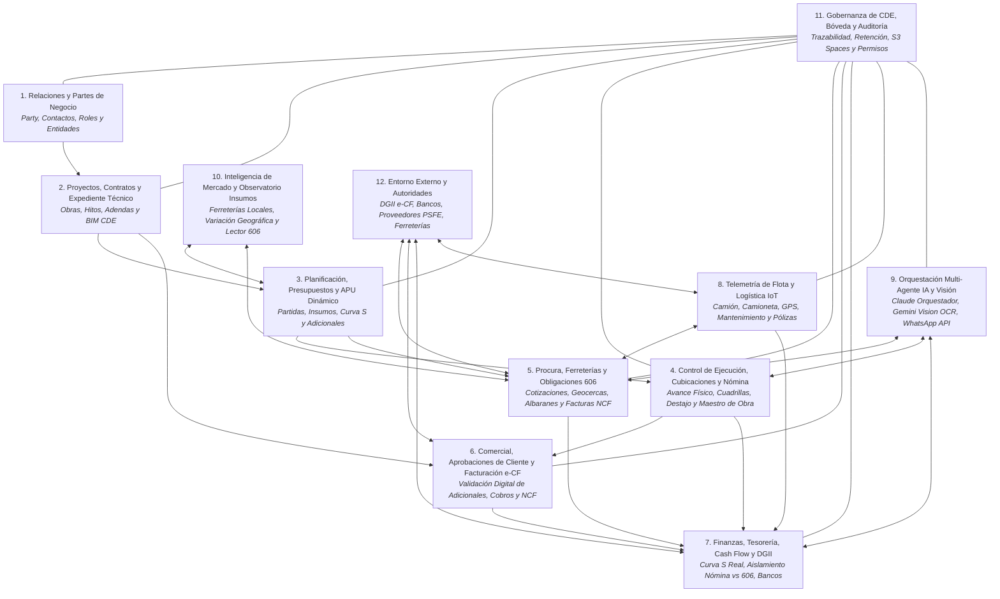

# Mapa de Dominios de Negocio (Domain Map) — CDE Constructora Angote SRL

## 1. Visión General (Overview)

**Estado:** Documento de Definición Arquitectónica y Mapa de Dominio de Negocio para el **Common Data Environment (CDE)** y **ERP Modular** **UNIFICADO** de **Constructora Angote SRL**.
Estas áreas delimitan fronteras semánticas del negocio de la construcción dominicana, gobernanza de datos y flujos de autoridad, no simples menús o tablas aisladas.



---

## 2. Áreas de Negocio Calibradas para Constructora Angote SRL

### 2.1. Relaciones y Partes de Negocio (*Business Relationships*)
- **Propósito:** Registro unívoco y persistente de la identidad legal, fiscal y operativa de toda entidad u organización que interactúa con Constructora Angote SRL.,
- **Conceptos Clave:** Parte (*Party*), Persona Física, Persona Jurídica, RNC / Cédula, Punto de Contacto, Rol de Negocio (Cliente, Subcontratista, Proveedor de Insumos, Empleado Fijo, Trabajador de Campo por Día, Chofer, Socio), Historial de Relaciones y Calificación Operativa. Las partes han de entenderse en su relacion jerarquica y de poder dentro de la organizacion, ejemplo de esto es la relacion entre el Ing. Superior, el Ing. de Campo, el Arquitecto y el Maestro de Obra es vertical en algunos casos y en otros horizontales, los cuales a su vez pueden ser relacionados con los proveedores como por ejemplo la relacion del Maestro de Obra con el proveedor de Block y Arena.
- **Regla Inviolable:** Una misma entidad jurídica o persona física posee un único registro maestro en el CDE, pero puede asumir múltiples roles fechados y no excluyentes (ej. un socio que también actúa como contratista o proveedor de equipo).

#### Partes, Roles, Perfiles y Usuarios del CDE

En el CDE, una **Parte** es una persona física u organización identificada en el registro maestro. Un **rol** describe la responsabilidad que esa Parte asume en una relación, proyecto u obra y puede cambiar con el tiempo. Un **usuario** es una identidad autenticada que accede a la plataforma; puede tener uno o varios perfiles de acceso. Un **perfil** agrupa permisos funcionales. Los permisos se asignan según necesidad y alcance, no por el cargo nominal. Los **insumos** son recursos catalogados, no Partes, aunque cada proveedor de esos insumos sí es una Parte.

**Partes y roles identificados:**
- **CEO / Dirección General:** Define dirección, prioridades y asignación de recursos; decide o delega decisiones de inversión y alcance y aprueba asuntos ejecutivos dentro de sus atribuciones. En el CDE consulta indicadores y autoriza decisiones reservadas a Dirección.
- **Cliente / Promotor:** Parte que encarga o financia el proyecto. Consulta entregables y avances, emite observaciones y aprueba presupuestos, cambios, certificaciones u otros hitos cuando así lo establece el contrato.
- **Suplidores / Proveedores:** Personas u organizaciones que cotizan o suministran materiales, equipos o servicios. Reciben solicitudes, presentan ofertas y entregan documentos comerciales; su acceso se limita a sus propios procesos y documentos.
- **Insumos:** Materiales, equipos consumibles, mano de obra y otros recursos utilizados o costeados en el proyecto. Se catalogan con unidad, especificación, precio y fuente; se vinculan a proveedores, APUs, presupuestos, requisiciones, órdenes y recepciones. No son usuarios ni Partes.
- **Administrador de la empresa:** Coordina procesos administrativos, documentación y autorizaciones operativas delegadas. Mantiene expedientes y soportes; no sustituye la aprobación técnica ni la autorización financiera reservada a otros responsables.
- **Contabilidad:** Clasifica y revisa comprobantes, obligaciones, retenciones y registros fiscales; prepara reportes 606/607 y conciliaciones para validación y presentación conforme a las responsabilidades legales de la empresa.
- **Recursos Humanos:** Mantiene expedientes laborales, contratos, cargos, altas/bajas, capacitaciones y datos de nómina con acceso restringido. Coordina con HSEQ las evidencias de inducción y formación, sin exponer datos laborales a usuarios no autorizados.
- **Abogados / Asesoría Legal:** Revisa contratos, adendas, reclamaciones, obligaciones, permisos y riesgos legales; emite observaciones y dictámenes. No aprueba por sí sola cambios técnicos ni pagos.
- **Ingeniero (general):** Profesional técnico asignado a una disciplina o función del proyecto. El CDE debe registrar su especialidad, responsabilidad, proyecto, entregables y autoridad de revisión o aprobación.
- **Ingeniero del Departamento de Presupuestos / Costos:** Estructura partidas, cantidades, APUs, presupuestos y análisis de variaciones; documenta fuentes, supuestos y versiones y somete las líneas base y cambios a aprobación.
- **Ingeniero Residente:** Responsable técnico-operativo de uno o varios frentes. Registra bitácora, cantidades, recursos, incidencias y evidencias; inspecciona trabajos y recomienda o valida mediciones dentro de la matriz de autoridad.
- **Ingeniero Senior / Ingeniero Superior:** Proporciona supervisión técnica, revisa entregables y desviaciones y escala decisiones. Aprueba únicamente los asuntos asignados formalmente a su nivel.
- **Ingeniero Estructuralista:** Desarrolla y revisa cálculos, memorias, especificaciones y planos estructurales; responde consultas y evalúa impactos de cambios en su disciplina.
- **Ingeniero Sanitario:** Desarrolla y revisa diseños, memorias, especificaciones y planos de agua potable, aguas residuales y drenaje; coordina interfaces y responde consultas de su disciplina.
- **Ingeniero Eléctrico:** Desarrolla y revisa diseños, memorias, especificaciones y planos eléctricos; coordina interfaces y responde consultas de su disciplina.
- **Ingeniero Junior:** Apoya levantamientos, cálculos, planos, inspecciones y actualización documental bajo revisión del profesional responsable. No emite aprobaciones reservadas a un revisor autorizado.
- **Arquitecto:** Desarrolla y coordina el diseño arquitectónico, planos, especificaciones y respuestas a consultas de su disciplina.
- **Arquitecto Senior:** Lidera o revisa soluciones arquitectónicas, coordinación interdisciplinaria y cumplimiento de criterios de diseño; registra observaciones y aprobaciones asignadas.
- **Decoradores:** Proponen acabados, mobiliario y elementos decorativos según alcance. Sus selecciones se registran como propuestas hasta ser aprobadas e incorporadas a documentos o presupuesto autorizados.
- **Diseñadores de interiores:** Desarrollan distribución, acabados, mobiliario, iluminación interior y documentación de interiores; coordinan sus decisiones con arquitectura y disciplinas técnicas.
- **Paisajista:** Diseña espacios exteriores, especies, riego y acabados de paisaje; coordina redes y drenajes y entrega planos y criterios de mantenimiento.
- **Contratistas:** Personas u organizaciones contratadas directamente para ejecutar un alcance. Consultan documentos autorizados, registran entregables y evidencias y presentan mediciones o solicitudes según su contrato.
- **Subcontratistas:** Partes contratadas por un contratista o por la empresa para un paquete delimitado. Su relación contractual y responsable principal deben quedar registrados; su acceso se limita al alcance, frente y documentos asignados.
- **Maestro de Obra / Capataz:** Coordina en campo las cuadrillas, secuencias diarias, materiales y herramientas; reporta recursos, producción e incidencias al Ingeniero Residente. No certifica por sí solo trabajos ni autoriza pagos salvo delegación expresa.
- **Empleados:** Personas vinculadas laboralmente a la empresa, con cargo, unidad, proyecto si aplica, supervisor y vigencia registrados. Su rol laboral no implica automáticamente acceso al CDE.
- **Choferes:** Personal o proveedores responsables de conducir y entregar materiales o equipos. Registran viajes, entregas, conduces e incidencias de flota según permisos; acceden solo a la información operativa necesaria.
- **Obreros / Operarios:** Personal que ejecuta trabajos especializados o generales en obra. Puede aportar registros de asistencia, actividad, seguridad y producción mediante el supervisor o una interfaz autorizada; no accede por defecto a información contractual o financiera.
- **Peones / Ayudantes:** Personal de apoyo a las cuadrillas. Se registra su asignación, asistencia, capacitación y supervisión, con acceso limitado a sus propias tareas cuando la plataforma lo requiera.
- **Supervisores:** Revisan el cumplimiento de alcance, método, calidad, seguridad y avance en el ámbito que tengan asignado. Registran inspecciones y hallazgos; una recomendación no equivale a aprobación contractual o financiera.
- **Inspectores:** Ejecutan verificaciones técnicas, HSEQ o de calidad con listas de chequeo, resultados y evidencias. Su autoridad para aceptar, rechazar o liberar una actividad depende de su nombramiento y matriz de aprobaciones.

**Roles adicionales necesarios para el flujo de trabajo:**
- **Director o gerente de proyecto:** Integra alcance, costo, plazo, riesgos y responsables; coordina decisiones entre dominios y escala a Dirección las que exceden su autoridad.
- **Planificador / Scheduler:** Mantiene la EDT/WBS, dependencias, hitos, línea base y actualizaciones del cronograma; analiza desviaciones sin registrar transacciones financieras.
- **Coordinador BIM / Gestor de información:** Administra modelos federados, coordinación de disciplinas, incidencias de interferencias, nomenclatura y estados de información; no reemplaza la aprobación de diseño de cada disciplina.
- **Responsable HSEQ:** Mantiene matrices de riesgos, inducciones, permisos de trabajo, inspecciones, incidentes, medidas correctivas y evidencias ambientales y de calidad que le correspondan.
- **Responsable de Calidad / Laboratorio:** Gestiona planes de inspección y ensayo, muestras, resultados, no conformidades y liberaciones técnicas dentro de su competencia y acreditación.
- **Responsable de Procura / Comprador:** Gestiona requisiciones, solicitudes de cotización, comparativos, órdenes y seguimiento a suplidores, respetando presupuesto, niveles de aprobación y segregación de funciones.
- **Almacenero / Encargado de almacén:** Registra recepción, inspección, ubicación, despacho, devolución y existencias de materiales y herramientas, vinculándolos con proyecto, obra y centro de costos.
- **Controlador de costos / Analista de costos:** Compara presupuesto, compromisos, devengos y costos reales; prepara alertas y análisis de variación para revisión de los responsables.
- **Tesorería:** Programa y registra cobros y desembolsos autorizados, concilia movimientos bancarios y adjunta comprobantes; no aprueba por sí sola el soporte técnico ni fiscal que origina el pago.
- **Administrador del CDE / Seguridad de información:** Gestiona cuentas, perfiles, permisos, altas/bajas, configuración y auditoría técnica. No recibe autoridad automática para aprobar contratos, mediciones o pagos por administrar la plataforma.
- **Representante del cliente / Supervisión externa:** Revisa entregables y certificaciones en nombre del cliente conforme al contrato, registra comentarios y ejerce únicamente las aprobaciones delegadas.
- **Consultores y especialistas externos:** Geotécnicos, topógrafos, laboratorios, especialistas MEP, ambientales u otros. Entregan estudios y revisiones dentro de su alcance, con autoría, credenciales y vigencia documentadas.
- **Autoridades y entidades reguladoras:** MIVED, ayuntamientos, MOPC, MITUR, Ministerio de Medio Ambiente y otras entidades competentes. Se registran como entidades externas y sus expedientes, comunicaciones y resoluciones se archivan; no se representan como usuarios internos ni se presume integración directa con sus sistemas.
- **Entidades financieras y PSFE:** Bancos y proveedores de servicios de facturación electrónica participan mediante cuentas, comprobantes, estados o respuestas de servicio. Se gestionan como contrapartes o integraciones externas, no como aprobadores internos.
- **Auditor independiente / Revisor:** Consulta evidencia y registros dentro del alcance autorizado y documenta hallazgos. Debe tener acceso de solo lectura, salvo encargo expreso distinto.

**Participantes directos e indirectos del flujo:**
- **Directos (internos):** Dirección General, gerencia de proyecto, personal técnico y de diseño, Residente y equipo de campo, HSEQ y Calidad, Procura y Almacén, Administración, Contabilidad, Tesorería, Recursos Humanos y administración técnica del CDE. Se asignan a una unidad, proceso, proyecto u obra y responden por registrar, revisar o aprobar actividades internas según su función.
- **Indirectos (externos):** Clientes y sus representantes; contratistas, subcontratistas y suplidores; consultores, laboratorios e inspectores externos; asesores legales; auditores; autoridades; bancos y PSFE. Participan mediante entregables, comentarios, expedientes, facturas, certificaciones o servicios externos. Solo reciben cuenta de acceso si necesitan operar en el CDE y existe autorización; el resto de sus comunicaciones y documentos se registra como evidencia, sin crear usuarios innecesarios.

**Perfiles de acceso y participantes:**
- **Perfil Ejecutivo:** Dirección General; consulta transversal y aprueba decisiones ejecutivas asignadas.
- **Perfil de Gestión de Proyecto:** Director/gerente de proyecto; administra información del proyecto y coordina revisiones y aprobaciones delegadas.
- **Perfil Técnico y BIM:** Ingenieros, arquitectos y coordinador BIM; crea o revisa documentos de su disciplina y consulta las interfaces necesarias.
- **Perfil de Campo:** Residente, supervisores, maestros y personal autorizado; registra bitácora, avance, recursos, inspecciones e incidencias del frente asignado.
- **Perfil HSEQ y Calidad:** Responsables e inspectores autorizados; administra controles, ensayos, hallazgos y cierres correspondientes.
- **Perfil de Procura y Almacén:** Compradores y almaceneros; tramita requisiciones, cotizaciones, órdenes y movimientos de inventario autorizados.
- **Perfil Financiero y Contable:** Administración, Contabilidad y Tesorería; revisa soportes, registra obligaciones, prepara reportes y ejecuta pagos ya autorizados según segregación de funciones.
- **Perfil Legal y Recursos Humanos:** Acceso a contratos o expedientes laborales según ámbito, con restricción de datos confidenciales y sin acceso general a otros proyectos.
- **Perfil de Cliente / Contratista / Suplidor:** Acceso externo, limitado a sus proyectos, contratos, entregables, solicitudes y documentos compartidos.
- **Perfil de Auditor / Consulta:** Lectura de registros y evidencias autorizados, sin edición ni aprobación.
- **Perfil de Administración Técnica del CDE:** Gestiona identidades, permisos, configuración y auditoría de la plataforma; no debe autoasignarse aprobaciones de negocio.

**Reglas de asignación:** Cada usuario debe corresponder a una identidad individual verificable; las cuentas compartidas no permiten atribuir acciones y deben evitarse. Una cuenta se activa por invitación y se vincula a una Parte cuando corresponda, con organización, rol, proyecto/obra, supervisor, vigencia y perfil autorizados. Los usuarios externos reciben acceso limitado y revocable. Las aprobaciones quedan asociadas a la persona, fecha, objeto y versión aprobada. Cuando sea posible, quien prepara una transacción no debe ser la única persona que la revisa y autoriza; las excepciones requieren delegación documentada. La baja o cambio de función revoca o ajusta los accesos sin borrar el historial de auditoría.

**Distinción de identidad y autoridad:** Ser Parte, tener un cargo, poseer una cuenta o aparecer como responsable de una tarea no confiere por sí solo autoridad de aprobación. Las atribuciones se determinan por contrato, delegación vigente y matriz de aprobación del proyecto; cada persona solo puede aprobar dentro de su ámbito asignado.

________


### 2.2. Proyectos, Contratos y Expediente Técnico (*Projects, Contracts & BIM CDE*)
- **Propósito:** Delimitación legal, geográfica, temporal y técnica de cada intervención constructiva ("Catalina", "Torre Romana", "Angamos Residence", etc.).
- **Conceptos Clave:** Proyecto, Contrato Principal, Sitio/Geolocalización de Obra, Centro de Costos, Adendas Contractuales, Modelo Digital BIM (IFC / Revit / Visor 3D), Planos Aprobados, Especificaciones Técnicas y Bitácora Digital de Obra.
**Proyecto**: Un Proyecto se comprende como una entidad con vida propia que se desarrolla en un periodo de tiempo y tiene un presupuesto y unos objetivos definidos, el proyecto es la unidad minima de registro en el sistema, es decir, que todo lo que se registre en el sistema debe estar relacionado con un proyecto, de igual forma el proyecto tiene un centro de costo y un responsable asignado, los cuales a su vez se relacionan jerarquicamente con otras partes de negocio como por ejemplo el Ing. Superior, el Ing. de Campo, el Arquitecto y el Maestro de Obra. Un proyecto puede contener varias obras, y cada obra puede tener varios centros de costos y varios responsables asignados, segun rol categoria o disciplina.
__que comprende un proyecto__: La planificacion conceptual, el diseño, Los planos 2D el modelo BIM (IFC / Revit, Archicad, Scketchup / Visor 3D) (de diferentes disciplinas arquitectonico, estructural, MEP, etc.), el presupuesto base y adicionales (adendas), las obras, La contratacion, los contratos (parte legal), Estudios y Analisis (estudio de suelo, estudio topografico, estudio hidrografico, etc.), El paisajismo y Jardineria, los centros de control de costo y gastos (pagos, cubicaciones, compras, etc.), los Cronogramas e hitos, la planificacion financiera (parte contable y de flujo de caja), la bitacora digital (parte de registro de actividades, control de avance fisico, recursos, personal, equipos, materiales, etc.), la telemetria y sensores IoT de obra, Las Evaluaciones de Sostenibilidad, la capa analitica (curvas s , valor ganado EVM, CPI, SPI, CV, SV, BAC, EAC y   Variance Analysis), la gestión del cambio, el cierre del proyecto, la evaluacion post-proyecto y los aprendizajes obtenidos (que deben servir para mejorar los procesos, herramientas y tecnologias y elevar la calidad, eficiencia, productividad, seguridad y sostenibilidad de futuros proyectos), la gestión **HSEQ (Health, Safety, Environment and Quality; Salud, Seguridad, Medio Ambiente y Calidad)** y la **permisología legal** aplicable (MIVED, ayuntamientos, MOPC, MITUR, Ministerio de Medio Ambiente y demás entidades competentes, según el alcance y la ubicación del proyecto).

#### Desglose Detallado y Delimitación Operativa de los Conceptos del Proyecto:

1. **La Planificación Conceptual (*Conceptual Planning*):**
   - **Definición y Alcance:** Fase embrionaria y estratégica donde se formula la viabilidad técnica, comercial, legal y financiera de la intervención constructiva, o de diseño si es un proyecto de diseño solamente o una consultoria. Establece el acta de constitución (*Project Charter*), los objetivos de rentabilidad económica para Constructora Angote SRL, el perfil del promotor/cliente, el estudio de cabida en el solar o lote y la zonificación urbanística preliminar.
   - **Componentes en el CDE:** Estudio de prefactibilidad, memoria de intenciones arquitectónicas, estimación paramétrica de orden de magnitud (costo preliminar por m² o unidad con rango de precisión ROM ±20-30%), análisis de restricciones de entorno y calendario tentativo de macro-hitos.
   - **Delimitación y Fronteras:** No contiene planos ejecutivos aptos para construir, ni cómputos de cubicación de campo, ni APUs contractuales. Su frontera finaliza con la decisión directiva (*Go / No-Go*) que autoriza el pase a la etapa de diseño formal y la contratación de estudios de suelo y topografía.

2. **El Diseño (*Multidisciplinary Architectural & Engineering Design*):**
   - **Definición y Alcance:** Proceso de desarrollo técnico, cálculo riguroso y fundamentación normativa que traduce el concepto en soluciones constructivas viables. Integra de forma coordinada todas las ramas de la ingeniería y la arquitectura bajo el marco regulatorio del Pais donde se este desarrollando el proyecto, en caso de Republica Dominicana es el **MIVED** (Ventanilla Única de Construcción - VUC) y el nuevo **Código de Construcción de la República Dominicana (CDCRD 2026, Vol. I al V)** —que actualiza y sustituye a los antiguos R-033, R-001 y reglamentos de la serie R bajo estándares internacionales ACI 318 y ASCE 7-22 para diseño sísmico y de viento—, así como los códigos hidrosanitarios y eléctricos aplicables.       

   - **Disciplinas Integradas:** Arquitectura, Ingeniería Estructural (hormigón armado, perfiles metálicos, cimentaciones), Instalaciones Hidrosanitarias (distribución de agua potable, aguas residuales y drenaje pluvial), Instalaciones Eléctricas (acometidas de media/baja tensión, cuadros de carga, iluminación, fuerza), Climatización/HVAC, Redes Especiales (contraincendios, voz y datos, seguridad, control de acceso) y Paisajismo.
   - **Componentes en el CDE:** Memorias de cálculo estructural, memorias descriptivas de cargas, memorias sanitarias y de ventilación, especificaciones técnicas de materiales y fichas de requerimientos de equipos.
   - **Delimitación y Fronteras:** Constituye el sustento técnico y matemático de cálculo; se delimita frente a los *Planos* (que son el producto gráfico contractual y formal) y frente al *Modelo BIM* (que es la representación tridimensional paramétrica e interactiva). Concluye en su fase inicial cuando las memorias técnicas quedan congeladas y aprobadas para tramitación, sin embargo cabe destacar que esta fase no muere pues siempre se debe tener acceso a las memorias de diseño Para tramitar y gestionar cambios. (Ejemplo: En una fase posterior de obra se requiere cambiar una especificación de concreto, se debe tener acceso a la memoria de diseño para entender las implicaciones del cambio en la estructura y garantizar la seguridad del proyecto).

3. **Los Planos (*Drawings, Blueprints & Technical Expedient*):**
   - **Definición y Alcance:** Representación gráfica bidimensional normalizada y codificada que comunica formalmente las soluciones de diseño. Es el documento contractual y jurídico que guía la ejecución material in situ y ampara las licencias oficiales ante las autoridades de cada pais, en caso de Republica dominicana (MIVED, Ayuntamientos locales, Ministerio de Medio Ambiente, Ayuntamientos, Codia, Cuerpo de Bomberos, Ministerio de Turismo, etc.).
   - **Ciclo de Vida y Estados en el CDE:** *Anteproyecto*, *Plano para Trámites Municipales/Gubernamentales*, *Plano Apto para Construir (IFC - Issued for Construction)*, *Planos de Taller/Fabricación (Shop Drawings)* y *Planos Conforme a Obra (As-Built)*.
   - **Componentes en el CDE:** Rótulo estandarizado según codificación Angote / ISO 19650 (`[Proyecto]-[Disciplina]-[Nivel]-[Tipo]-[Revisión]`, etc.), sellos y firmas de ingenieros/arquitectos colegiados en el CODIA en R.D. o en la entidad acreditada segun el Pais del proyecto, sellos institucionales de aprobación, plantas arquitectónicas, elevaciones, cortes longitudinales y transversales (en formato .pdf o .dwg), detalles constructivos, tablas de terminaciones y planillas de doblado de acero, tablas de puertas y ventanas.
   - **Delimitación y Fronteras:** Un plano es un entregable legal congelado y fechado. En el CDE de Angote se visualiza directamente en el visor in-app (Bóveda S3) sin forzar descargas locales a menos de ser requerido por el usuario. Cualquier modificación surgida en campo no se anota manualmente sobre el papel, sino que exige un RFI (*Request for Information*) y la emisión de una nueva revisión documental formal (Rev 0 -> Rev A -> Rev B).

4. **El Modelo BIM (IFC / Revit / Visor 3D):**
   - **Definición y Alcance:** Un modelo Bim es la representacion tridimencional (3D) de la edificacion puede asociarse como Gemelo digital tridimensional, paramétrico y federado del proyecto que consolida en una base de datos espacial única la geometría, propiedades físicas y metadatos de cada disciplina (Arquitectónico, Estructural, MEP, etc.). Permite la coordinación técnica previa al inicio de obra y la navegación interactiva tanto para la supervisión como para el cliente.
   - **Niveles de Desarrollo (LOD):** Desde LOD 200 (volumetría y componentes aproximados), LOD 300/350 (dimensiones precisas, interfaces mecánicas, refuerzos estructurales y trazado coordinado de tuberías), hasta LOD 400 (fabricación y montaje de elementos) y LOD 500 (*As-Built* de operación y mantenimiento).
   - **Componentes en el CDE:** Detección de interferencias espaciales (*Clash Detection* automatizado generalizado, ej. entre vigas, losas y ducterías MEP), tablas de extracción geométrica automatizada de cantidades (tablas de planificacion) (volúmenes de hormigón en m³, áreas de encofrado en m², peso de acero en kg/toneladas, metros lineales de tuberías) y visor 3D web integrado con compatibilidad abierta IFC y modelos Revit.
   - **Delimitación y Fronteras:** El modelo BIM no reemplaza per se al contrato ni al presupuesto y analisis de costo (APU); es la fuente unificada de verdad geométrica. No es una simple maqueta gráfica de renderizado, sino una base de datos tridimensional que alimenta las cubicaciones teóricas y permite contrastar el avance físico real reportado en bitácora.

5. **El Presupuesto Base y Adicionales (Adendas):**
   - **Definición y Alcance:** Estructuración económica valorada de los costos directos e indirectos del proyecto, desglosada jerárquicamente en capítulos, partidas, subpartidas e insumos elementales mediante Análisis de Precios Unitarios (APU). Posee diferentes vertientes de riguroso aislamiento en el sistema:
     - *Presupuesto Base Aprobado:* Línea base contractual económica inicial convenida y rubricada con el promotor/cliente.
     - *Presupuesto de Adicionales (Adendas):* Modificaciones de alcance, aumentos de volumen, obras extraordinarias o cambios de especificaciones solicitados por el cliente o derivados de contingencias técnicas debida, imprevistos generados por condiciones no estipuladas en las condiciones iniciales, contratos o evaluaciones iniciales.
   - **Componentes en el CDE:** Costos directos (materiales, Insumos, mano de obra especializada/peones, equipos, subcontratos, costos asociados, carga operativa temporal *oficinas temporales de obra y banos temporales*), costos indirectos (administración, dirección técnica, gastos generales de obra, imprevistos, beneficio de empresa, seguros y cargas sociales TSS), precio contractual de venta, librería global de APUs con fecha y proyecto de origen, y flujo de aprobación de adendas (*Borrador*, *Sometido* *En Revision*, *Aprobado Digitalmente por Cliente*, *Rechazados*).
   - **Delimitación y Fronteras:** **Regla Inviolable de Angote:** El Presupuesto Base constituye la línea base inmutable del proyecto; jamás se sobreescribe cuando surgen adicionales. Toda adenda se agrega de forma aditiva y segregada con su propio APU y precios unitarios aprobados, impidiendo mezclar los compromisos contractuales de origen con las variaciones en curso.
   5.2 **Analisis de Costo o Analisis de Precios unitarios (APUS)**
   - **Definición y Alcance:** El Análisis de Precios Unitarios (APU) determina el costo estimado de ejecutar una unidad de una partida, conforme a sus especificaciones, ubicación, condiciones de obra y fecha de cálculo. Sirve de base para valorar el presupuesto y estimar los recursos requeridos, sin sustituir la medición de cantidades ni la aprobación contractual, ejemplos: se Analiza que cuesta de 1m3 de hormigon de una viga, una columna o una losa, segun sus especificaciones, que cuesta 1m2 de empanete o careteo, que cuesta colocar 1m2 de blocks de 6´´ o de 8´´´, que cuesta 1ml de tuberia x o y, etc. se trata de analizar que cuesta fabricar una partida de forma unitaria o de forma general analizando los costos asociados de insumos y mano de obra y las cantidades especificas asociadas a la partida en analisis y el metodo definido para analizar, sea ml, m2, m3, p2, pl, etc. .
   - **Componentes del Análisis:** Desglose de materiales e insumos con cantidades de consumo, desperdicios y precios; mano de obra por categoría, cuadrilla, rendimiento y cargas aplicables; equipos y herramientas según tiempo de uso, rendimiento y costos asociados; y costos indirectos o cargos complementarios conforme a la metodología de Angote. El análisis identifica la unidad de pago, el costo por recurso, los subtotales y el precio unitario resultante, dejando explícitos los criterios y supuestos utilizados, **los apus estaran alimentados de los insumos de la base de datos del CDE, los costos de mano de obra estaran asociados a las referencias en la base de datos** .
   - **Trazabilidad y Control:** Cada Analisis de costo o APU conserva su proyecto y partida de origen, unidad de medida, fecha y fuente de precios, rendimientos, autor, versión y estado de aprobación. Los APUs pueden reutilizarse como referencia desde la librería global, pero cualquier adaptación genera una versión identificable y no modifica los análisis ya aprobados. Las variaciones de alcance o precio que afecten compromisos contractuales se gestionan mediante el presupuesto de la adenda correspondiente; no alteran la línea base aprobada.
    
6. **Las Obras (*Works / Physical Execution Fronts & Intervention Sites*):**
   - **Definición y Alcance:** Subdivisión física, espacial o por etapas de ejecución que reside dentro de un Proyecto. Representa el frente operativo tangible en terreno donde se concentran los recursos, cuadrillas y maquinarias (ej. en el Proyecto "Catalina", las obras pueden ser "Villas", "Torre 1", Torre 2", "Casa Club y Áreas Sociales" o "Infraestructura Vial y Servicios", "Escuelas"), en pocas palabras una obra es la ejecucion fisica de un proyecto, el planteamiento fisico de lo establecido en el Modelo BIM o planos aprobados, construcciones, remodelaciones, anexos, etc.
   - **Componentes en el CDE:** Identificador unívoco de obra subordinado al ID de Proyecto, geocerca perimétrica específica en mapa, Ingeniero Residente / de Campo responsable del frente, centros de costo secundarios asignados por categoría o disciplina, almacén de campo local y lista de cuadrillas activas.
   - **Delimitación y Fronteras:** Una Obra no es un Proyecto independiente; no posee personalidad jurídica ni contractual autónoma frente al cliente final. Su propósito es la delimitación geográfica y operativa en campo para evitar que las contingencias o desvíos de un frente distorsionen el análisis de los demás frentes del proyecto.

7. **La Contratación (*Procurement, Sourcing & Subcontractor Onboarding*):**
   - **Definición y Alcance:** Proceso técnico-comercial y de debida diligencia mediante el cual Constructora Angote SRL licita, evalúa, negocia y selecciona a los subcontratistas, proveedores de servicios especializados y cuadrilleros que ejecutarán los paquetes de trabajo de la obra.
   - **Componentes en el CDE:** Paquetes de licitación (*Scope of Work* / Términos de Referencia), pliegos de condiciones técnicas, recepción y cuadro comparativo de cotizaciones, matriz de evaluación técnica y económica, verificación de solvencia legal/moral de la Parte (*Party* en el registro maestro) y calificación histórica de calidad en obras anteriores de Angote SRL.
   - **Delimitación y Fronteras:** Abarca la fase pre-contractual de selección y negociación. Su frontera termina en el acto formal de adjudicación; da paso inmediato a la formalización jurídica del Contrato. Ningún subcontratista o maestro de obra puede ser asignado a un frente sin haber completado este proceso.

8. **Los Contratos (Parte Legal) (*Legal Contracts, Bonds & Guarantees*):**
   - **Definición y Alcance:** Instrumentos jurídicos formales, legalizados y vinculantes que norman los derechos, deberes, penalizaciones, garantías, plazos y condiciones de pago entre Constructora Angote SRL y las partes del negocio:
     - *Contrato Principal de Construcción:* Celebrado con el Cliente/Promotor, Aqui se delimitan las condiciones contractuales del proyecto, se establecen los limites y alcances del proyecto en sentido general, limites temporales del proyecto y sus hitos, las condiciones de pago (se define si se realizaran por cubicaciones o atraves de pagos programados en un cashflow definido en fechas determinadas es decir un cronogramas de pagos), se establecen las condiciones de penalidades y limites de penalidades en base a cumplimientos establecidos no cumplidos en ambas partes, condiciones de excepcion para aplicar penalidades, es decir todo lo concernientes y limites generales del proyecto y sus condiciones de pago y de tiempo.
     - *Subcontratos de Obras y Servicios:* Celebrados con empresas especializadas (instalaciones, estructuras metálicas, ventanería, etc.).
     - *Contratos de Prestación de Servicios / Mano de Obra por Ajuste:* Celebrados con maestros de obra o líderes de cuadrilla calificados.
     - *Adendas Contractuales Formales:* Documentos legales aditivos que respaldan modificaciones en monto o prórrogas de tiempo aprobadas.
     - *Contratos de Personal Tecnico Asociado: *Documento legal Para contratacion de personal tecnico de forma directa en la compania.
     - *Contratos de Personal de Oficina y administrativo: *Documento legal Para contratacion de personal administrativo y de oficina (Administradores, contables, secretarias, Ingenieros de oficina, Arquitectos, Ingenieros de Obra y todo el personal asociado bajo el cargo de la parte administrativa y recursos humanos, el personal que forma parte integral de la compania y representantes directos de la compania de manera formal, personal de trabajo continuo o temporal a largo plazo con distinciones jerarquicas referenciales a su cargo y posicion o proyecto y su estatus dentro de la entidad).
       
   - **Componentes en el CDE:** Cláusulas de alcance y especificaciones, esquema de pagos y condiciones de cubicación, retenciones de fondo de garantía (habitualmente entre 5% y 10%), pólizas de fiel cumplimiento, póliza de responsabilidad civil, póliza de vicios ocultos (Responsabilidad Decenal del Art. 1792 del Código Civil dominicano), causales de rescisión, penalidades por atraso imputable y repositorio inmutable en la Bóveda S3 con trazabilidad de firma.
   - **Delimitación y Fronteras:** El Contrato fija el marco de exigibilidad jurídica y gobernanza de riesgos; no se confunde con la Orden de Compra operativa ni con la Cubicación física. La cubicación certifica la cantidad ejecutada; el contrato determina cuándo, bajo qué retenciones y en qué plazos legales procede el desembolso.

9. **Los Centros de Control de Costo y Gastos (Pagos, Cubicaciones, Compras, etc.):**
   - **Definición y Alcance:** Estructura de segregación analítica y presupuestaria que clasifica, imputa y controla cada transacción económica del proyecto a lo largo de su ciclo de vida en tres estados financieros: *Comprometido* (Contratos Adjudicados y órdenes de compra), *Devengado* (cubicaciones físicas o digitales aprobadas in situ o facturas formales con NCF recibidas) y *Desembolsado* (pagos, transferencias bancarias ejecutadas, cheques) (Seguimiento a Costos asociados a proyectos vs partidas presupuestadas, etc.).
   - **Componentes en el CDE:** Código estructurado de centro de costos (`[ID_PROYECTO]-[ID_OBRA]-[DISCIPLINA/PARTIDA]`), clasificadores de gasto (Mano de Obra Directa, Insumos/Materiales, Equipos y Combustible, Subcontratos, Gastos Indirectos), matriz de autorizaciones por rol (Ing. de Campo -> Ing. Superior -> Administración Central), flujo de conciliación de tres vías (*Three-Way Match*: Requisición -> Conduce/Cubicación -> Factura NCF -> Pago) y balance presupuestario en tiempo real.
   - **Delimitación y Fronteras:** El Centro de Costos no es la cuenta bancaria de tesorería; es la cuenta analítica de imputación y control, asociada a los costos asociados de un proyecto para su revision analitica general y manejo integral de la vida del proyecto (con este manejo y control asociado se podra llevar control total de las metricas analiticas correspondientes asociadas a una vida sana de un proyecto entendiendo que gastar mas es perdida y gastar menos no siempre significa que es bueno sino que tambien genera alertas pues puede suponer un desbalance en la calidad de los servicios de Angote por lo que debe siempre someterse a revision todo excedente superior o igual al costo asociado de una partida y todo ahorro que supere un 20% o mas de la partida asociada). **Regla Inviolable:** Ninguna erogación, orden de compra o cubicación puede existir en el CDE sin vincularse inequívocamente a un Proyecto y a un Centro de Costos activo con responsable asignado (exceptuando únicamente gastos administrativos corporativos y de flota debidamente autorizados).

10. **Los Cronogramas e Hitos (*Schedules, WBS & Milestones*):**
    - **Definición y Alcance:** Modelado y control de la dimensión temporal del proyecto, estructurado a partir de la Estructura de Desglose del Trabajo (EDT/WBS). Determina la secuencia lógica de actividades, calcula las duraciones operativas a partir de los rendimientos de los APU, identifica la Ruta Crítica (CPM) y fija los hitos contractuales no negociables de cada proyecto, obra , remodelacion, anexno, etc.
    - **Componentes en el CDE:** Diagrama de Gantt interactivo con dependencias lógicas (Comienzo-Comienzo, Fin-Comienzo, etc.), holgura libre y total por tarea, línea base temporal congelada (*Baseline Schedule*), hitos de control clave (ej. "Término de Cimentación", "Estructura Nivel 4 Vaciada", "Cierre de Fachadas", "Entrega Provisional"), y conexión con el Agente Multi-Agente de IA y en casos avanzados con modelos predictivos, para alertas preventivas automáticas a subcontratistas vía WhatsApp, Email y llamadas VOIP y Normales previo al vencimiento de entregas, todo proyecto BIM y no BIM generara automaticamente un borrador del cronograma al presionar el boton de generar asistido por AI conectado a las partidas del presupuesto, rendimientos de cuadrillas y personal de la base de datos y/o al modelo BIM, generando su organizacion, su estructuracion sus fechas estimadas y la ruta critica recomendada por la AI desarrollando asi borradores robustos y avanzados para revision humana puede que sean tan certeros que no necesiten ninguna modificacion, sin embargo la IA no elimina la supervision y la dependencia humana, estos agentes no seran AI generativa alucinando, sino un proceso estructurado en base a reglas predeterminadas, los documentos del proyecto pasan por un ETL, por un data frame un analisis descriptivo luego una prospeccion un clustering y luego una prescripcion que ayude a los modelos a generar los cronogramas sin alucinaciones, sirve para informaciones, presupuestos, Modelos BIM y planos (Estos tienen un tratamiento especial pues los modelos BIM y planos tambien se convierten en un grafo para mejor manejo de los asistentes de IA).
    - **Delimitación y Fronteras:** Modela y gestiona exclusivamente el factor tiempo y ritmo de ejecución. No registra por sí mismo los desembolsos de dinero sino que presenta los borradores si llega informacion al modelo para previa aprobacion del encargado humano, (hace borradores de responsabilidad de la Planificación Financiera y la Curva S), proporciona la base sobre la cual se calcula el rendimiento temporal y las desviaciones de cronograma.

11. **La Planificación Financiera (Parte Contable y de Flujo de Caja):**
    - **Definición y Alcance:** Proyección dinámica, gobernanza de liquidez y conciliación de los flujos monetarios que garantizan la salud operativa del proyecto a lo largo del tiempo. Integra el *Cash Flow Proyectado vs. Real*, la gestión de cobros comerciales y el cumplimiento fiscal estricto ante la Dirección General de Impuestos Internos (DGII).
    - **Componentes en el CDE:** Curva de Egresos Planificada vs. Desembolsos Reales, Flujo de Caja Operativo semanal y mensual, calendario de Cuentas por Cobrar (AR - clientes) y Cuentas por Pagar (AP - suplidores y subcontratistas), fondo de maniobra requerido por fase constructiva, provisiones de retenciones fiscales (ISR, ITBIS) y cargas de la Seguridad Social (TSS).
    - **Delimitación y Fronteras:** **Aislamiento Contable Absoluto:** El módulo financiero aísla estrictamente la nómina del personal administrativo de la nomina de proyectos obras, cubicaciones y jornales de campo (maestros de obra, destallistas), las compras y servicios amparados por comprobantes fiscales NCF/e-CF (Formato 606), impidiendo inconsistencias tributarias. Se delimita del Presupuesto Base en que este último dice *cuánto* costará la obra en su totalidad, mientras que la Planificación Financiera determina *cuándo* y *con qué fondos líquidos* se solventará cada etapa.

12. **La Bitácora Digital (Registro de Actividades, Avance Físico, Recursos, Personal, Equipos, Materiales, etc.):**
    - **Definición y Alcance:** Cuaderno oficial, cronológico, inmutable y georreferenciado de la vida diaria en cada frente de obra. Constituye la fuente testimonial y probatoria de hechos (*Ground Truth*) que respalda técnicamente el avance físico real antes de autorizar cualquier pago o emitir una cubicación al cliente o subcontratista.
    - **Componentes y Registros Diarios en el CDE:**
      - *Condiciones Ambientales:* Clima, precipitaciones y estado del terreno (evidencia legal para justificar ampliaciones de plazo por fuerza mayor).
      - *Personal y Mano de Obra:* Conteo diario de personal por cuadrilla y especialidad (varilleros, albañiles, carpinteros, plomeros, electricistas, ayudantes), horas laboradas, incidencias de disciplina o seguridad y maestro de obra a cargo.
      - *Equipos y Maquinaria:* Registro de maquinaria activa (camión pesado, camioneta, grúas torre, trompos, generadores), horas efectivas de motor, tiempos muertos y suministro de combustible.
      - *Recepción y Control de Materiales:* Registro de conduces y albaranes de entrega recepcionados in situ (hormigón premezclado, varilla, agregados, blocks), con verificación de firmas de recepción conforme.
      - *Avance Físico y Actividades Ejecutadas:* Tareas concretas desarrolladas por partida, nivel y eje estructural, vaciados de hormigón con control de probetas y resultados de laboratorio.
      - *Evidencia Fotográfica y Multimodal:* Fotografías inalterables con marca de agua (fecha, hora y geolocalización GPS), audios de campo procesados por el motor de IA (vía WhatsApp / Plaud/app misma) e instrucciones técnicas del Ingeniero Residente.
    - **Delimitación y Fronteras:** Es un registro empírico y testimonial de campo; no es el documento financiero de pago ni la certificación contable, pero es el requisito previo e indispensable sin el cual el Ingeniero Residente y el Ingeniero Superior tienen prohibido aprobar cubicaciones de obra.

13. **La Capa Analítica (Data Science & Data Analysis) (Curvas S, Valor Ganado EVM, CPI, SPI, CV, SV, BAC, EAC y Variance Analysis):**
    - **Definición y Alcance:** Motor de inteligencia de negocio, control gerencial y diagnóstico predictivo que cruza continuamente los datos del Cronograma (Tiempo), el Presupuesto APU (Costo) y las Cubicaciones de la Bitácora (Alcance Real Ejecutado) aplicando la metodología internacional de Gestión del Valor Ganado (*Earned Value Management - EVM*). Permite detectar desvíos de manera temprana y proyectar el costo y la fecha real de término antes de que ocurran pérdidas financieras.
    - **Métricas y Componentes de Inteligencia:**
      - **Curvas S:** Gráfico acumulado dinámico que superpone el Valor Planificado (*PV - Planned Value* / Curva S Programada), el Costo Real (*AC - Actual Cost* / Desembolsos devengados) y el Valor Ganado (*EV - Earned Value* / Trabajo físico real certificado a precios presupuestados).
      - **BAC (*Budget at Completion*):** Presupuesto total base aprobado más adendas aprobadas; el costo total presupuestado final.
      - **PV (*Planned Value*):** Monto presupuestado del trabajo programado que debió haberse ejecutado a la fecha de corte según cronograma.
      - **EV (*Earned Value*):** Valor presupuestado del trabajo que efectivamente fue ejecutado, medido y aprobado en campo.
      - **AC (*Actual Cost*):** Costo real devengado incurrido para ejecutar el trabajo reflejado en el EV.
      - **CV (*Cost Variance*) & SV (*Schedule Variance*):** Variación de Costo (`CV = EV - AC`) y Variación de Cronograma (`SV = EV - PV`). Un valor positivo indica ahorro o adelanto; un valor negativo indica sobrecosto o retraso.
      - **CPI (*Cost Performance Index*) & SPI (*Schedule Performance Index*):** Índices de eficiencia (`CPI = EV / AC`, `SPI = EV / PV`). Índices mayores a 1.0 denotan alta productividad y eficiencia de costo/tiempo; índices menores a 1.0 alertan fallas de rendimiento que demandan intervención inmediata.
      - **EAC (*Estimate at Completion*):** Proyección del costo total final del proyecto según la tendencia observada (`EAC = BAC / CPI`).
      - **Variance Analysis (*Análisis de Variaciones*):** Diagnóstico analítico desglosado por partida y disciplina que aísla la causa raíz de las discrepancias (incremento de precios de materiales ferreteros vs. bajo rendimiento de mano de obra en campo) para guiar las medidas correctivas del Ingeniero Superior.
    - **Delimitación y Fronteras:** No genera transacciones primarias de compras ni contratos; es el tablero ejecutivo superior de supervisión, visualización predictiva y control estratégico que garantiza el gobierno integral de la constructora.

14. **Los Estudios y Análisis Técnicos Preliminares (*Preliminary Technical Studies & Ground Investigation*):**
    - **Definición y Alcance:** Investigaciones científicas, ensayos de campo y determinaciones geotécnicas, topográficas, geofísicas e hidrológicas que caracterizan físicamente el terreno y su entorno antes de iniciar el diseño estructural y las excavaciones. Constituyen la base matemática y geomecánica obligatoria según el **Código de Construcción de la República Dominicana (CDCRD 2026, Vol. I al V)** y normativas ASTM/ACI para garantizar la estabilidad, sismorresistencia y seguridad de la edificación.
    - **Disciplinas y Estudios Comprendidos:**
      - *Estudio Geotécnico / Mecánica de Suelos:* Ensayos SPT (*Standard Penetration Test*), calicatas a cielo abierto, sondeos rotatorios con recuperación de testigos, capacidad de carga admisible ($q_{adm}$ en kg/cm² o ton/m²), módulo de balasto, estratigrafía, profundidad del nivel freático, potencial de licuefacción sísmica y recomendaciones de cimentación (zapatas aisladas, losa de cimentación, pilotes o mejoramiento de suelo).
      - *Estudio Topográfico y Altimétrico:* Levantamiento planimétrico y altimétrico georreferenciado con estación total y drones (fotogrametría RTK), curvas de nivel a intervalos normalizados, deslindes catastrales según la Jurisdicción Inmobiliaria (JI) de R.D., ubicación de hitos perimetrales, servidumbres y rasantes de vías colindantes.
      - *Estudio Hidrológico e Hidrográfico:* Análisis de cuencas de escorrentía, niveles de inundación para períodos de retorno ($Tr = 25, 50, 100$ años), capacidad de infiltración del terreno y diseño de pozos filtrantes o drenaje pluvial primario.
      - *Estudio de Impacto Ambiental Preliminar:* Identificación de pasivos ambientales, flora protegida y requerimientos de autorización ambiental ante el Ministerio de Medio Ambiente y Recursos Naturales (Ley 64-00).
    - **Componentes en el CDE:** Informes geotécnicos firmados y timbrados por ingenieros geotécnicos y laboratorios acreditados en PDF inmutable (Bóveda S3), archivos de nube de puntos y curvas de nivel en formato DWG/LandXML importables directamente al modelo digital BIM/Civil 3D, y parámetros geotécnicos tabulados accesibles directamente por el calculista estructural en las memorias de diseño.
    - **Delimitación y Fronteras:** Los Estudios Técnicos representan la verdad física del sitio; no sustituyen la memoria de cálculo estructural ni los planos ejecutivos, sino que son la condición obligatoria *sine qua non* para diseñarlos. Cualquier discrepancia entre lo revelado por las perforaciones preliminares y el suelo real descubierto durante el desbroce/movimiento de tierra exige un protocolo geotécnico de confirmación antes de autorizar el vaciado de hormigón de limpieza (*blinding concrete*).

15. **El Paisajismo y Jardinería (*Landscape Architecture, Hardscape & Green Integration*):**
    - **Definición y Alcance:** Especialidad arquitectónica y ecológica que diseña, ejecuta y mantiene los espacios exteriores abiertos, terrazas verdes, jardines perimetrales y elementos duros (*hardscape* como senderos, adoquines, pérgolas, espejos de agua) integrados al proyecto. Busca el confort bioclimático, la valorización comercial del inmueble y el cumplimiento normativo municipal de porcentaje mínimo de áreas verdes permeables.
    - **Componentes en el CDE:**
      - *Catálogo Botánico y Especies:* Selección rigurosa de vegetación autóctona o adaptada al microclima de República Dominicana (especies xerófitas o tropicales de bajo consumo hídrico, resistencia a salinidad en zonas costeras como La Romana o Punta Cana, y tolerancia a vientos de huracán).
      - *Redes Hidráulicas de Riego Tecnificado:* Planos y especificaciones de sistemas de riego automatizado (por goteo, microaspersión o difusores programados por electroválvulas y sensores de humedad).
      - *Iluminación Paisajística y Exteriores:* Circuitos eléctricos independientes de bajo consumo (luminarias solares o LED IP65/IP67) coordinados con la disciplina MEP.
      - *APUs de Paisajismo:* Partidas específicas para movimiento de tierra vegetal/sustrato enriquecido, suministro y siembra de árboles maduros, palmas, arbustos, césped (tipo Zoysia/Bermuda) y periodo contractual de mantenimiento inicial y riego garantizado durante la etapa de asentamiento de especies.
    - **Delimitación y Fronteras:** Se coordina directamente con las instalaciones hidrosanitarias exteriores y el drenaje pluvial del proyecto para evitar encharcamientos o daños por raíces en redes subterráneas y cimentaciones. Su entregable contractual incluye tanto los planos paisajísticos aprobados como el manual de mantenimiento y fertilización transferido al cliente final.

16. **Las Evaluaciones de Sostenibilidad y Gestión Ambiental (*Sustainability, Circularity & Environmental Compliance*):**
    - **Definición y Alcance:** Marco de gobernanza ambiental, eficiencia de recursos y responsabilidad ecológica aplicado a lo largo de todo el ciclo de vida del proyecto. Asegura el cumplimiento riguroso de la Ley General de Medio Ambiente (Ley 64-00 de la República Dominicana), las normativas del Ministerio de Medio Ambiente y Recursos Naturales, y los estándares de sostenibilidad constructiva (reducción de huella de carbono, eficiencia energética y uso racional del agua).
    - **Componentes en el CDE:**
      - *Plan de Manejo y Adecuación Ambiental (PMAA):* Matriz de mitigación de impactos in situ (control de polvo por riego de agua, barreras perimetrales acústicas, protección de taludes y escorrentías).
      - *Gestión de Residuos de Construcción y Demolición (RCD):* Registro y cuantificación en bitácora del pesaje/volumen de escombros clasificados (hormigón para reciclaje/relleno, chatarra de acero, madera reutilizable y residuos no reciclables) y trazabilidad de disposición en vertederos autorizados.
      - *Eficiencia Energética y Calidad Ambiental Interior (IEQ):* Análisis de orientación solar, envolvente térmica, ventilación natural cruzada y selección de materiales con bajo Contenido de Compuestos Orgánicos Volátiles (VOC).
      - *Métricas de Desempeño Hídrico y Eléctrico:* Estimación y verificación de ahorros proyectados en consumo de agua potable (griferías de bajo caudal, captación de aguas pluviales) y previsión de canalizaciones para generación fotovoltaica o cargadores de vehículos eléctricos.
    - **Delimitación y Fronteras:** No es una simple declaración de intenciones; genera evidencias documentales auditables (manifiestos de transporte de residuos, certificaciones de origen de madera certificada, permisos de vertido). Es la frontera que valida el cumplimiento socioambiental exigido por instituciones financieras, fondos fiduciarios y promotores con criterios ESG (*Environmental, Social and Governance*).

17. **La Telemetría y Sensores IoT de Obra (*Site Telemetry, IoT Equipment & Physical Monitoring*):**
    - **Definición y Alcance:** Despliegue de instrumentación digital conectada, hardware IoT y dispositivos telemáticos in situ en el frente de obra y sus activos asociados. Automatiza la captura de magnitudes físicas críticas, monitorea el rendimiento y la seguridad de maquinarias y equipos en tiempo real, Revision EPP en tiempo real, e ingesta directamente datos crudos de campo a la Bitácora Digital del CDE sin intervención humana propensa a sesgos o errores manuales.
    - **Componentes y Sensores en el CDE:**
      - *Sensores de Madurez y Curado del Hormigón:* Sondas IoT embebidas en losas, columnas y vigas críticas que registran la evolución de la temperatura interna y calculan en tiempo real la ganancia de resistencia a compresión ($f'c$), habilitando el desencofrado seguro y acelerado con sustento paramétrico verificable.
      - *Estación Meteorológica y Sensores Ambientales in situ:* Medición continua de temperatura ambiente, humedad relativa, velocidad de ráfagas de viento y pluviometría (lluvia caída en mm/hora). Proporciona evidencia técnica irrefutable para la justificación de paralizaciones de vaciado de hormigón o reclamos de ampliación de plazo contractual por lluvias excesivas.
      - *Telemetría y Horómetros Digitales en Maquinaria de Obra:* Dispositivos GPS e interfaces OBD-II / CAN-bus instalados en generadores eléctricos, trompos de hormigón, grúas torre, camión de carga pesada y camionetas operativas. Monitorean horómetros efectivos de trabajo vs. tiempos muertos en ralentí, consumo de combustible por hora/kilómetro y generación automática de órdenes de mantenimiento preventivo.
      - *Sensores Piezométricos y de Deformación:* Monitoreo de niveles freáticos durante excavaciones profundas y clinómetros/sensores de deformación en muros de contención o taludes colindantes a edificaciones vecinas.
    - **Delimitación y Fronteras:** Los sensores IoT proveen evidencia objetiva en tiempo real (*Ground Truth* físico instrumental). No sustituyen los ensayos oficiales de laboratorio de rotura de probetas cilíndricas ante el CODIA/MIVED, sino que brindan monitoreo continuo intermedio para la toma de decisiones ágiles del Ingeniero de Campo y evitan fraudes en el reporte de horas de maquinaria y consumo de diésel.

18. **La Gestión del Cambio (*Change Management & Scope Control*):**
    - **Definición y Alcance:** Procedimiento sistemático y gobernanza técnica mediante el cual se identifican, documentan, evalúan, aprueban o rechazan formalmente todas las solicitudes de modificación al alcance original del proyecto (*Change Requests*). Protege al proyecto contra el deslizamiento descontrolado del alcance (*Scope Creep*) y garantiza que toda variación técnica tenga un análisis previo de impacto en el costo (APU), en el tiempo (Ruta Crítica del cronograma) y en la seguridad estructural.
    - **Flujo de Gobernanza en el CDE:**
      1. *Registro de Solicitud de Cambio (CR):* Emitida por el Cliente, la Supervisión, el Ingeniero de Campo o el Diseñador, respaldada por un RFI (*Request for Information*) o instrucción técnica formal.
      2. *Evaluación de Impacto Multidimensional:* Análisis integrado del costo adicional o deductivo, impacto en días de cronograma y revisión de interferencias en el modelo BIM.
      3. *Dictamen de Dirección Técnica (Raymond):* Revisión y pre-aprobación técnica.
      4. *Aprobación Vinculante del Promotor/Cliente:* Aprobación digital expresa en la plataforma CDE mediante token de validación.
      5. *Derivación a Contratos y Presupuesto:* Una vez aprobada, se genera automáticamente la **Adenda Presupuestaria** y la adenda contractual legal correspondiente.
    - **Delimitación y Fronteras:** **Regla Inviolable de Angote:** Ninguna orden verbal en obra ni modificación de planos sobre el papel autoriza la ejecución de un cambio de alcance. Hasta tanto una solicitud de cambio no complete el ciclo de aprobación digital en el CDE, los frentes de obra tienen prohibido desviar recursos o materiales hacia dicha partida extraordinaria.

19. **El Cierre del Proyecto y Entrega (*Project Closure, Commissioning & Handover*):**
    - **Definición y Alcance:** Fase de culminación técnica, legal, administrativa y económica de la intervención constructiva. Comprende la verificación exhaustiva de todas las obras ejecutadas frente a los planos contractuales y especificaciones técnicas, la puesta en marcha de sistemas electromecánicos (*Commissioning*), el levantamiento y subsanación de detalles menores (*Punch List*), y la transferencia formal de la custodia física y legal del inmueble al Cliente/Promotor.
    - **Componentes en el CDE:**
      - *Inspección y Punch List Digital:* Registro fotográfico geolocalizado de detalles estéticos o no conformidades de terminación, asignados a los subcontratistas responsables con plazos estrictos de subsanación y verificación antes de la recepción.
      - *Pruebas de Puesta en Marcha (Commissioning):* Protocolos de prueba de presión en tuberías de agua potable, pruebas de estanqueidad en techos y terrazas, pruebas de aislamiento de cuadros eléctricos, balance de flujo de aire HVAC y pruebas de presurización de escaleras y bombas contra incendios con actas firmadas.
      - *Actas de Entrega Provisional y Definitiva:* Instrumentos jurídicos de transferencia formal que marcan el cese de responsabilidades de custodia por parte de la constructora y el inicio de los plazos de garantía.
      - *Dossier y Expediente Conforme a Obra (As-Built):* Paquete consolidado de planos As-Built en PDF/DWG, modelo BIM LOD 500, catálogos técnicos, fichas de garantías de equipos instalados y manual de usuario y mantenimiento preventivo de la edificación.
      - *Liquidación Contractual y Financiera:* Conciliación de cuentas finales, balance de adendas pagadas vs devengadas, liquidación de retenciones de fondo de garantía y expedición del descargo de responsabilidad recíproca (*Finiquito Legal*).
    - **Delimitación y Fronteras:** El Cierre del Proyecto extingue la fase constructiva activa y activa formalmente la **Responsabilidad Decenal** (Artículo 1792 del Código Civil de la República Dominicana) por vicios mayores ocultos y la póliza correspondiente.

20. **La Evaluación Post-Proyecto y Gestión de Aprendizajes (*Post-Project Review & Continuous Improvement*):**
    - **Definición y Alcance:** Proceso de auditoría retrospectiva, análisis forense de desempeño y capitalización del conocimiento organizacional que se ejecuta tras el cierre de cada proyecto en Constructora Angote SRL. Su objetivo es transformar la experiencia empírica de campo en mejoras sistemáticas cuantificables de procesos, rendimientos de cuadrillas, optimización de herramientas y actualización tecnológica para obras futuras.
    - **Componentes en el CDE:**
      - *Auditoría Forense de Costo y Tiempo:* Comparación rigurosa entre el Presupuesto Base ($BAC$), el Costo Real incurrido ($AC$) y las proyecciones intermedias ($EAC$), identificando partidas con pérdidas o sobrecostos atípicos (análisis de causa raíz: fallas de subcontratistas, volatilidad de insumos o errores de estimación).
      - *Calificación y Ranking Histórico de Proveedores y Subcontratistas:* Evaluación objetiva de cada Parte (*Party*) en el registro maestro según tres factores: cumplimiento de cronograma, calidad técnica in situ y disciplina de seguridad/limpieza.
      - *Retroalimentación a la Librería Global de APUs:* Actualización automática o supervisada de los rendimientos de mano de obra (m²/día de pañete, kg/día de colocación de acero, etc.) y consumo real de insumos en la base de datos de APUs de Angote SRL para afilar la precisión de futuras licitaciones.
      - *Repositorio de Lecciones Aprendidas (Knowledge Base):* Fichas de incidentes, soluciones a cuellos de botella constructivos, alternativas de materiales más eficientes e innovaciones exitosas implementadas en la obra para consulta transversal de todo el equipo de ingenieros superiores y residentes.
    - **Delimitación y Fronteras:** No es una evaluación de desempeño punitiva, sino el motor de mejora continua (*Kaizen*) de la constructora. Sus resultados alimentan directamente los parámetros con los que los Agentes de IA (Claude/Gemini) auditan futuros presupuestos y programaciones.

21. **La Gestión HSEQ (Health, Safety, Environment and Quality; Salud, Seguridad, Medio Ambiente y Calidad):**
      - **Definición y Alcance:** Sistema de gestión transversal que identifica y controla los riesgos laborales y operativos, previene lesiones y enfermedades ocupacionales, reduce los impactos ambientales de las actividades de obra y verifica que los procesos y entregables cumplan los requisitos técnicos y de calidad aplicables.
      - **Componentes en el CDE:** Plan HSEQ por proyecto y obra; matrices de peligros, riesgos e impactos; inducciones y capacitaciones; entrega y control de equipos de protección personal; permisos de trabajo para actividades de riesgo; inspecciones y auditorías; reportes de incidentes y casi accidentes; controles ambientales; Seguimiento Utilizacion de EPP; Cursos de Altura; resultados de ensayos e inspecciones de calidad; registro de no conformidades, acciones correctivas y evidencias de cierre.
      - **Delimitación y Fronteras:** HSEQ gobierna la prevención y el control operativo durante el diseño y la ejecución, y conserva evidencia verificable de su cumplimiento. Se coordina con la sostenibilidad y la gestión ambiental, pero no las sustituye; tampoco reemplaza las autorizaciones de las autoridades, la responsabilidad profesional del diseñador ni la supervisión técnica de la obra.

22. **La Permisología Legal y Regulatoria (*Permits, Licenses & Regulatory Approvals*):**
      - **Definición y Alcance:** Gestión del ciclo de vida de los permisos, licencias, aprobaciones y autorizaciones requeridos para diseñar, construir, modificar y entregar cada proyecto. Identifica los requisitos aplicables según la ubicación, el uso y el alcance de la intervención; coordina la preparación y presentación de expedientes, y da seguimiento a su revisión, aprobación, vigencia, condiciones y cierre.
      - **Componentes en el CDE:** Matriz de requisitos y trámites por proyecto y obra; entidad competente; responsable; fechas de presentación, respuesta y vencimiento; planos y documentos sometidos con sus revisiones; número de expediente; estado del trámite; observaciones y respuestas; permisos o resoluciones aprobados; condiciones asociadas; inspecciones y evidencias de cumplimiento; renovaciones y cierre del expediente.
      - **Delimitación y Fronteras:** Comprende la gestión documental y el seguimiento de trámites ante las entidades competentes —por ejemplo, MIVED, ayuntamientos, MOPC, MITUR y Ministerio de Medio Ambiente, según corresponda—. El CODIA puede intervenir en requisitos de colegiatura, firmas o validación profesional, pero no se considera por sí mismo una autoridad emisora de permisos de construcción. La permisología no sustituye la aprobación interna del diseño, la gestión HSEQ ni los contratos del proyecto.


- **Regla Inviolable:** Ninguna orden de compra, cubicación o pago puede existir en el CDE sin vincularse inequívocamente a un Proyecto y a un Centro de Costos activo con responsable asignado, a excepcion de aquellas ordenes de compras u ordenes de trabajo para mantenimientos en la oficina o lugar de tabajo y/o otras referencias debidamente documentadas y aprobadas por el Ing. Superior, gastos miscelaneos aprobados por la administracion y gastos de mantenimiento a vehiculos equipos propios u otras referencias debidamente documentadas y aprobadas por la administracion, la finalidad de esto es mantener un control de gastos operativos blindado para la empresa.

### 2.3. Planificación, Presupuestos y APU Dinámico (*Planning, Budgeting & Dynamic APU*)
- **Propósito:** Modelado estructurado de costos directos e indirectos, análisis de rendimientos y programación temporal de la inversión antes y durante la obra.
- **Conceptos Clave:** Partida, Subpartida, Insumo Base (cemento, varilla, hormigón, agregados), Análisis de Precios Unitarios (APU), Presupuesto Base Aprobado, Presupuesto de Adicionales (con trazabilidad segregada), Curva S Programada y Calendario de Hitos.
- **Regla Inviolable:** Los APUs generados en el sistema se almacenan en una librería global reusable, pero quedan etiquetados con el proyecto de origen y la fecha de cotización. Todo adicional al presupuesto debe sumarse al total del proyecto sin sobreescribir la línea base contractual inicial.

### 2.4. Control de Ejecución, Cubicaciones y Nómina de Obra (*Work Delivery, Field Progress & Site Payroll*)
- **Propósito:** Cuantificación física del trabajo ejecutado en campo, certificación de avances y liquidación de mano de obra directa.
- **Conceptos Clave:** Cubicación Física por Partida (% de avance verificado in situ), Planilla de Destajo/Ajuste, Nómina Diaria de Campo, Maestro de Obra, Cuadrilla, Inspección Fotográfica y Aprobación de Residente.
- **Regla Inviolable:** La medición de avance para pago a un subcontratista o maestro de obra está estrictamente amarrada a la inspección física de la partida; no se liberan fondos sin evidencia de medición y visto bueno de supervisión técnica.

### 2.5. Procura, Gestión de Proveedores/Ferreterías y Obligaciones 606 (*Procurement & 606 Obligations*)
- **Propósito:** Solicitud, cotización comparativa, adquisición, recepción en obra y reconocimiento de obligaciones con suplidores de materiales y servicios formales.
- **Conceptos Clave:** Requisición de Materiales, Solicitud de Cotización, Orden de Compra, Conduce / Albarán de Entrega, Factura Comercial con NCF/e-CF (B01, E31, etc.), Perfil de Proveedor Ferretero (El Detallista, Ochoa, etc.) y Reporte Fiscal 606.
- **Regla Inviolable:** Para el reconocimiento de costo formal deducible, la factura debe poseer NCF/e-CF válido ante la DGII verificado por el sistema o por el motor de visión artificial Gemini.

### 2.6. Gestión Comercial de Clientes, Aprobación de Adicionales y Facturación e-CF (*Client Commercial & e-CF Invoicing*)
- **Propósito:** Administración de la relación contractual y financiera con el propietario o promotor del proyecto.
- **Conceptos Clave:** Modalidad de Pago (Cash Flow por Cuotas vs Cubicación de Avance Real), Presentación de Presupuesto con identidad de marca B&W, Botón de Aprobación Digital de Adicionales, Certificado de Avance al Cliente, Factura de Venta Electrónica (e-CF tipo E31/E32) y Estado de Cuenta de Cliente.
- **Regla Inviolable:** Ninguna partida adicional genera cobro o se incorpora al cronograma definitivo sin que el cliente haya ejecutado la validación/aprobación digital expresa en la plataforma.

### 2.7. Finanzas, Tesorería, Cash Flow y Cumplimiento Tributario DGII (*Finance, Cash Flow & DGII Compliance*)
- **Propósito:** Control de flujos de efectivo, conciliación bancaria, proyección de desembolsos, liquidación y reporting fiscal ante la DGII.
- **Conceptos Clave:** Cash Flow Proyectado vs Real, Curva S de Inversión Acumulada, Cuentas por Pagar (Proveedores y Subcontratistas), Cuentas por Cobrar (Clientes), Asiento de Nómina Directa (TSS/IR-3), Declaración Jurada Formato 606 (Compras y Gastos) y Formato 607 (Ventas).
- **Regla Inviolable:** **Aislamiento Contable Absoluto:** Los desembolsos de nómina de personal de campo (jornales, destajos) no se registran jamás bajo el formato 606 de compras de bienes/servicios con NCF; deben mantenerse en módulos contables segregados para evitar contingencias fiscales ante la DGII.

### 2.8. Gobernanza de CDE, Bóveda Documental y Auditoría (*CDE Governance, Document Vault & Audit Trail*)
- **Propósito:** Centralización documental segura en la nube (S3 Spaces), gestión de permisos por rol y registro cronológico inmutable de acciones.
- **Conceptos Clave:** Bóveda Digital (DigitalOcean Spaces S3), Visualizador In-App de Planos y Documentos (sin forzar descargas locales), Registro de Auditoría (*Audit Log*), Generador Automático de Contratos, Pólizas de Seguro, Matrículas y Licencias.
- **Regla Inviolable:** Todo documento cargado (factura, plano, póliza, adenda) es inmutable; las correcciones generan nuevas versiones o notas de ajuste con autor y fecha, garantizando trazabilidad judicial y contable.

---

## 3. Nuevas Áreas de Dominio Incorporadas (Diferenciadores Clave de Angote SRL)

### 3.1. Telemetría de Flota Vehicular y Logística de Obra (*Fleet Telemetry & IoT Logistics*)
- **Propósito:** Gestión física, monitoreo geográfico, control de costos operativos y mantenimiento preventivo de los vehículos de la constructora (camioneta operativa y camión pesado de carga).
- **Conceptos Clave:** Activo Vehicular, Dispositivo GPS / Telemetría API, Geocercas (Ferreterías, Almacén, Obras), Bitácora Mecánica de Servicios, Costo de Mantenimiento por Km/Hora, Amortización de Vida Útil, Bóveda de Pólizas de Seguro, Matrículas y Licencias de Choferes.
- **Reglas de Negocio:**
  - Alerta preventiva automatizada (Email / WhatsApp y dashboard en rojo) con **30 y 15 días** de anticipación al vencimiento de seguros, matrículas o licencias.
  - Vinculación directa entre el costo de combustible/mantenimiento y los centros de costos de los proyectos beneficiados.

### 3.2. Orquestación Multi-Agente de IA y Captura Multimodal (*Autonomous AI Multi-Agent & Multimodal Ingestion*)
- **Propósito:** Automatización inteligente de tareas operativas y de campo mediante un orquestador central (ADK) y agentes especializados, conectados vía canales estándar (Base de datos, Capa analitica, Motor de Inferencia, CDE API, Ejecucion de tareas autonomas, WhatsApp, Email, Dashboards).
- **Agentes Especializados:** **EJEMPLOS:**
  1. **Agente de Compras:** Consulta autónoma de precios a ferreterías vía diferentes medios, Internet, Email, WhatsApp, llamadas, etc. este agente puede cruzar la ubicación GPS del camión pesado para aprovisionamiento optimizado en ruta.
  2. **Agente de Tiempos y Cronograma:** Supervisión activa de subcontratistas vía WhatsApp previo al vencimiento de entregas, registrando bitácoras o escalando cuellos de botella al Ingeniero Residente.
  3. **Agente de Finanzas y Auditoría:** Detección de inconsistencias entre cubicación física y desembolsos, monitoreo de variaciones de APU y alertas de límites fiscales.
  4. **Motor de Visión Artificial Gemini (OCR Anti-Alucinaciones):** Ingesta masiva y procesamiento fotográfico de facturas físicas con rechazo programado automático ante ambigüedad en NCF, RNC o montos.

### 3.3. Inteligencia de Mercado y Observatorio de Insumos (*Market Data & Material Price Index*)
- **Propósito:** Monitoreo sistemático de los precios de insumos críticos de construcción en los principales polos económicos de República Dominicana (Santo Domingo, Santiago, Punta Cana y La Romana).
- **Conceptos Clave:** Índice de Variación de Precios, Frecuencia de Actualización Tri-Semanal, Catálogo Ferretero Homologado (El Detallista, Ochoa, etc.) y Estrategia Futura "Lector 606" (app gratuita con términos y condiciones para agregación anonimizada de inteligencia transaccional de costos del sector).

---

## 4. Distinciones Transversales Críticas a Validar (*Cross-Domain Invariants*)

1. **Parte (*Party*) ≠ Rol Operativo:** Una entidad (persona o empresa) tiene un RNC/cédula único; sus roles como cliente, subcontratista, proveedor ferretero o socio son relaciones temporales contextuales.
2. **Proyecto ≠ Contrato ≠ Centro de Costos ≠ Ubicación Física:** "Angamos Residence" es un proyecto que puede tener múltiples contratos (obra civil, terminaciones, supervisión), varios centros de costo (fase 1, adendas) y una geocerca física específica.
3. **Presupuesto Base ≠ Costo Comprometido ≠ Obligación Devengada ≠ Desembolso Real:**
   - *Presupuesto:* Lo planificado por APU.
   - *Comprometido:* La orden de compra o contrato emitido.
   - *Devengado:* La cubicación física aprobada o factura con NCF recibida.
   - *Desembolso:* El movimiento bancario efectivo registrado en tesorería.
4. **Las 3 Acepciones de "Cubicación":**
   - *Cubicación de Subcontratista:* Medición de campo para liquidar mano de obra o destajo.
   - *Cubicación al Cliente:* Certificación de avance físico presentada para cobro comercial.
   - *Cubicación de Control Interno:* Comparativa geométrica frente al modelo BIM y presupuesto base para alimentar la Curva S.
5. **Aislamiento Fiscal Estricto:** La mano de obra por ajuste o nómina de campo jamás se reporta en el 606; el 606 exige comprobantes fiscales válidos (e-CF con RNC/cédula de suplidor registrado).
6. **Nivel de Autoridad Documental:**
   - *Nivel 1 (Evidencia Cruda):* Foto de factura, audio Plaud, conduce firmado.
   - *Nivel 2 (Extracción IA):* JSON estructurado por Gemini Vision o Claude (sujeto a revisión).
   - *Nivel 3 (Registro de Negocio Aprobado):* Factura/Cubicación validada por el Residente o Contable.
   - *Nivel 4 (Reporte Oficial):* Archivo TXT 606 para DGII, factura electrónica e-CF timbrada o balance contable.

---

## 5. Respuestas Prescriptivas al Requerimiento de Revisión Inicial (*Initial Review Request*)

### Pregunta 1: Renombrar o corregir áreas para ajustarlas al lenguaje real de Constructora Angote SRL

| Nombre Propuesto Original (EN) | Término Operativo Calibrado (ES - Angote SRL) | Justificación Operativa y Alcance Dominicano |
| :--- | :--- | :--- |
| **Planning and Cost Control** | **Planificación, Presupuestos y APU Dinámico** | En la empresa el presupuesto se gestiona a nivel de insumos y APU (zapatas, hormigón, muros), separando de forma estricta los "Adicionales" con su propio flujo de aprobación. |
| **Work Delivery and Capacity** | **Control de Ejecución, Cubicaciones y Nómina de Obra** | Incorpora el término estándar dominicano `Cubicación` (avance físico real en %) y segrega la mano de obra directa (cuadrillas, destajos, maestros de obra). |
| **Procurement and Supplier Obligations** | **Procura, Ferreterías y Obligaciones 606** | Refleja la relación diaria con suplidores locales (El Detallista, Ochoa) y la exigencia de que toda compra formal culmine en el reporte tributario 606. |
| **Client Commercial and Billing** | **Gestión Comercial de Clientes, Adicionales y Facturación e-CF** | Enfatiza las dos modalidades de cobro (Cash Flow fijo vs Cubicación física), el botón digital de aprobación de adicionales y la emisión de facturas electrónicas e-CF con identidad B&W. |
| **Finance, Accounting, and Tax** | **Finanzas, Tesorería, Cash Flow y Cumplimiento DGII** | Prioriza la visualización bimodal (Dashboard ejecutivo y Curva S vs partidas) y la regla crítica de aislar nómina directa de los reportes 606. |
| **Governance and Records** | **Gobernanza de CDE, Bóveda Documental y Expediente Técnico** | Define el almacenamiento en DigitalOcean Spaces (S3) y la visualización de planos, pólizas y contratos directamente en la app sin requerir descargas. |

---

### Pregunta 2: Identificar áreas importantes que faltan en el mapa

Se identifican formalmente **4 áreas fundamentales** derivadas de las necesidades operativas de Angote SRL:

1. **Telemetría de Flota y Logística IoT (*Fleet Telemetry & IoT Logistics*):**
   - Gestión activa de la camioneta operativa y camión pesado. Monitoreo por GPS, cálculo de rutas hacia ferreterías, bitácora de mantenimiento mecánico y amortización de vida útil.
   - Bóveda de alertas tempranas para pólizas de seguro, matrículas y licencias con notificaciones a 30 y 15 días vía Email/WhatsApp y alerta visual en dashboard.
2. **Orquestación Multi-Agente de IA y Captura Multimodal (*Autonomous AI Multi-Agent & Multimodal Ingestion*):**
   - Núcleo inteligente basado en Claude API que orquesta subagentes: Agente de Compras (cotizaciones WhatsApp), Agente de Tiempo (seguimiento a subcontratistas) y Agente Financiero.
   - Extracción de facturas de campo mediante Gemini Vision API con filtros anti-alucinaciones y procesamiento de minutas de voz/audios de supervisión (Plaud Note).
3. **Inteligencia de Mercado y Observatorio de Insumos (*Market Intelligence & Material Index*):**
   - Monitoreo tri-semanal de precios de insumos en ferreterías por polo geográfico (Santo Domingo, Santiago, Punta Cana, La Romana).
   - Base de datos comercial de referencia para auditoría de presupuestos y preparación del modelo de datos de "Lector 606".
4. **CDE BIM y Modelado As-Built (*BIM Common Data Environment*):**
   - Vinculación del visor de modelos 3D (IFC/Revit) con el desglose de partidas y cubicaciones para inspección visual del avance físico de obra (ej. Angamos Residence).

---

### Pregunta 3: Designar a los responsables idóneos para liderar cada área

```mermaid
graph TD
    subgraph Dirección Estratégica y Obra
        RAY[Raymond - Dirección General / CEO]
        RES[Ingeniero Residente / Maestros de Obra]
    end
    subgraph Tecnología e Inteligencia
       CEO_
        - Arquitecto de Software & Cloud]
       _[ Analista de Datos & Mercado]
    end
    subgraph Administración y Cumplimiento
        CONT[Administrador / Perfil Contable CDE]
        PROCURA[Responsable de Procura / Choferes]
    end

    CEO ---|Lidera| PC[Proyectos, Clientes, Contratos y Visión Comercial]
    CEO ---|Valida| PLAN[Presupuestos Base, APU y Adicionales]
    RES ---|Ejecuta| WORK[Cubicaciones Físicas y Cuadrillas de Campo]
    SP2 ---|Diseña| TECH[Arquitectura Cloud, Base PostgreSQL y Multi-Agente IA]
    IOF ---|Modela| MARKET[Base de Precios de Insumos y Datos Ferreteros]
    CONT ---|Gobierna| FIN[Portal Contable, Aislamiento 606, Nómina y DGII e-CF]
     ---|Opera| FLEET[Flota, Conduces y Recepción de Materiales]
```

- **Raymond (CEO/ Dirección General / Constructor Líder):** Máxima autoridad en definición de APUs típicos, aprobación de adicionales de clientes, asignación de proyectos y acuerdos comerciales de alto nivel, Aprobacion de Arquitecturas Tech, Software, Infraestructura digital.
- (Tech Lead / Arquitecto Cloud):** Responsable de la infraestructura en Digital en este caso (PostgreSQL, App Platform, S3 Spaces, WAF Cloudflare, Redis, Duckdb), APIs, IA, WhatsApp Business API y seguridad del CDE.
- **Administrador / Perfil Contable CDE:** Responsable del portal contable, emisión de comprobantes electrónicos e-CF ante la DGII, generación automática de reportes 606 y 607, segregación de nóminas y conciliación de cuentas por cobrar/pagar.
- **(Analista de Datos):** Responsable de la estructura de base de datos de materiales, esquemas JSON, algoritmos de comparación de precios en ferreterías locales y métricas analíticas.
- **Ingenieros Residente / Supervisión de Obra:** Responsable del levantamiento de cubicaciones semanales in situ, verificación fotográfica, recepción física de insumos y bitácora de incidencias de contratistas.
- **Arquitectos:** Responsables del diseno y Planos Arquitectonicos.
- **Ingeniero Estructuralista:** Responsables de Disenos Estructural, Planos, Memoria de Calcula, etc.
- **Ingenieros Tecnicos:** Responsables de Disenos de Planos Tecnicos, MEP, HVAC, etc.

---

### Pregunta 4: Flujo Detallado End-to-End para el Primer Walkthrough

#### Flujo Integral de Trabajo y Gestión del CDE

El CDE gobierna la información y las aprobaciones durante el ciclo de vida del proyecto. Cada transacción y documento conserva su vínculo con el proyecto, la obra y el centro de costos que corresponda; las excepciones autorizadas se registran con su responsable y justificación. Las tareas automatizadas o asistidas por IA preparan datos y alertas, pero no sustituyen las revisiones ni aprobaciones asignadas a personas.

1. **Apertura y configuración del proyecto:** Dirección define el alcance inicial y la decisión de avanzar; se registra el proyecto, cliente y demás partes en el registro maestro, ubicación, responsables, obras, centros de costos, contratos previstos y jurisdicción aplicable. Se establecen permisos de acceso y una matriz de responsabilidades y aprobaciones.
2. **Requisitos, estudios y diseño:** Se recopilan requisitos del cliente y del sitio; se incorporan estudios técnicos, diseños, memorias, planos y modelos BIM con autoría, disciplina, revisión y estado. Los responsables técnicos revisan y emiten los documentos aptos para el trámite o para construcción. Las versiones aprobadas quedan identificadas; una revisión posterior no sobrescribe la anterior.
3. **Permisos y preparación HSEQ:** Se crea la matriz de permisos y autorizaciones aplicables, con entidad, expediente, responsable, fechas, observaciones, condiciones y evidencia de cierre. En paralelo, se preparan los controles HSEQ del proyecto y de cada frente: riesgos, inducciones, equipos de protección, permisos de trabajo, inspecciones, controles ambientales y calidad. El CDE registra el estado y las evidencias; la autoridad competente conserva la decisión de otorgar o denegar sus permisos.
4. **Líneas base de costo, alcance y tiempo:** Planificación estructura partidas y APUs, presupuesto base, cronograma y flujo financiero. La línea base aprobada se conserva sin sobrescritura. Los cambios de alcance, cantidades, costo o plazo se tramitan como solicitudes de cambio y, si se aprueban, se reflejan en versiones y adendas separadas.
5. **Contratación y procura:** Se documentan paquetes de trabajo, cotizaciones, comparativos, selección, contrato o subcontrato y órdenes de compra. Cada compromiso identifica su parte, proyecto, obra y centro de costos. La recepción registra conduce o albarán, cantidades, fecha, responsable y discrepancias; una factura se vincula con la compra y su recepción para revisión administrativa y fiscal.
6. **Ejecución y bitácora:** Antes de ejecutar, el frente consulta el contrato o alcance autorizado y la última revisión aplicable de planos y especificaciones. El Residente registra actividades, cantidades, personal, equipos, materiales, condiciones del sitio e incidencias, adjuntando evidencia disponible. Inspecciones HSEQ y controles de calidad registran hallazgos, responsables, acciones correctivas y cierre; un incumplimiento pendiente se escala y no se presenta como conforme.
7. **Medición, cubicaciones y certificaciones:** Se registran por separado la cubicación de subcontratista, la certificación de avance al cliente y la medición de control interno. Cada una referencia partida, unidad, periodo, cantidades, evidencia y versión contractual aplicable. El Residente valida la medición de campo y las aprobaciones siguen la matriz de autoridad del proyecto; una diferencia o un alcance no aprobado se devuelve para aclaración, no se convierte automáticamente en obligación de pago o cobro.
8. **Cambios y decisiones:** Toda solicitud identifica motivo, solicitante y documentos de respaldo. Las áreas técnica, de costos, planificación, HSEQ y permisología evalúan, cuando aplique, impactos en diseño, seguridad, calidad, permisos, presupuesto y cronograma. Dirección y cliente aprueban conforme a sus atribuciones; solo después se emiten las revisiones, adendas y autorizaciones necesarias para ejecutar el cambio. Una instrucción verbal no modifica la línea base.
9. **Contabilización, cobro y pago:** Administración revisa facturas, comprobantes y soportes; verifica la correspondencia con contrato u orden, recepción o cubicación aprobada, y clasificación fiscal aplicable. Las compras y servicios con comprobante válido se preparan para el tratamiento fiscal que corresponda; jornales y nómina directa de obra permanecen segregados del Formato 606. Los cobros al cliente siguen la modalidad contractual y requieren la certificación correspondiente. Tesorería registra el desembolso y su comprobante; el estado financiero distingue comprometido, devengado y pagado.
10. **Seguimiento, cierre y aprendizaje:** Los tableros y análisis comparan avance, cronograma, presupuesto, compromisos, devengado y desembolsos con sus fuentes aprobadas; cualquier extracción de IA se valida antes de convertirse en registro oficial. Al cierre se concilian cantidades y cuentas, se completan pendientes HSEQ y permisos, se reúnen entregables conforme a obra, garantías y manuales, y se documentan la entrega y las lecciones aprendidas para alimentar futuras referencias y APUs.

**Gobernanza transversal:** En todas las etapas, el CDE conserva autor, fecha, estado, aprobaciones, versiones y registro de auditoría. Los documentos se corrigen mediante una nueva versión o nota trazable; permisos de consulta, edición y aprobación se asignan por rol. Los estados del flujo reflejan el avance real y no equivalen por sí solos a una aprobación técnica, contractual, fiscal o de una autoridad.

---

## 6. Hoja de Ruta Inmediata de Implementación Tecnológica

