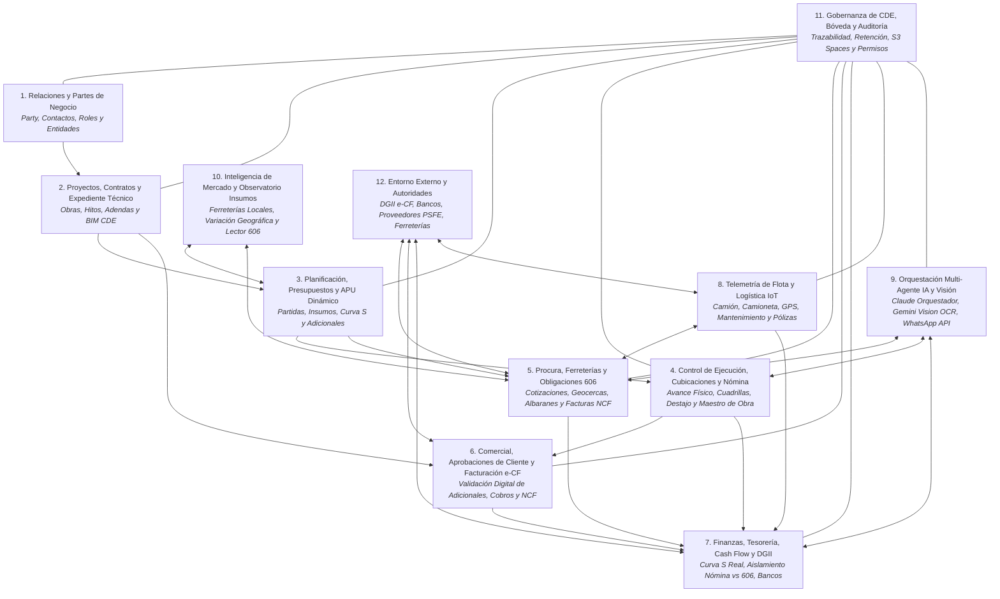
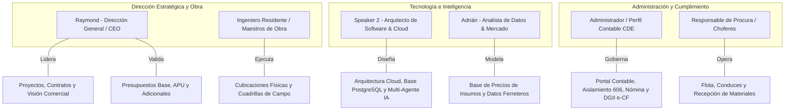
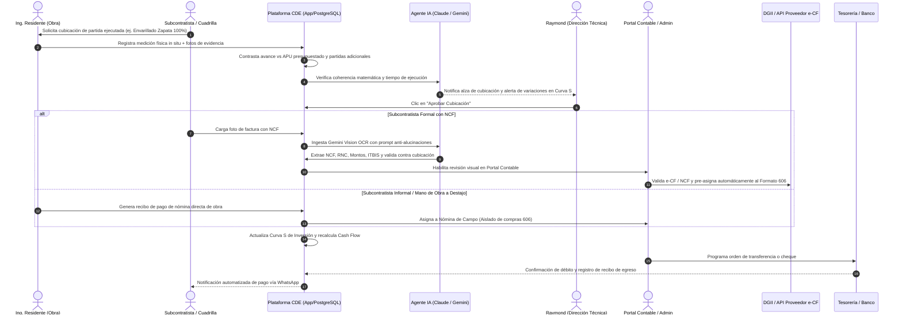

# Mapa de Dominios de Negocio (Domain Map) — CDE Constructora Angote SRL

## 1. Visión General (Overview)

**Estado:** Documento de Definición Arquitectónica y Mapa de Dominio de Negocio para el **Common Data Environment (CDE)** y **ERP Modular** de **Constructora Angote SRL**.
Estas áreas delimitan fronteras semánticas del negocio de la construcción dominicana, gobernanza de datos y flujos de autoridad, no simples menús o tablas aisladas.

---

## 2. Áreas de Negocio Calibradas para Constructora Angote SRL

### 2.1. Relaciones y Partes de Negocio (*Business Relationships*)
- **Propósito:** Registro unívoco y persistente de la identidad legal, fiscal y operativa de toda entidad u organización que interactúa con Constructora Angote SRL.,
- **Conceptos Clave:** Parte (*Party*), Persona Física, Persona Jurídica, RNC / Cédula, Punto de Contacto, Rol de Negocio (Cliente, Subcontratista, Proveedor de Insumos, Empleado Fijo, Trabajador de Campo por Día, Chofer, Socio), Historial de Relaciones y Calificación Operativa. Las partes han de entenderse en su relacion jerarquica y de poder dentro de la organizacion, ejemplo de esto es la relacion entre el Ing. Superior, el Ing. de Campo, el Arquitecto y el Maestro de Obra es vertical en algunos casos y en otros horizontales, los cuales a su vez pueden ser relacionados con los proveedores como por ejemplo la relacion del Maestro de Obra con el proveedor de Block y Arena.
- **Regla Inviolable:** Una misma entidad jurídica o persona física posee un único registro maestro en el CDE, pero puede asumir múltiples roles fechados y no excluyentes (ej. un socio que también actúa como contratista o proveedor de equipo).

### 2.2. Proyectos, Contratos y Expediente Técnico (*Projects, Contracts & BIM CDE*)
- **Propósito:** Delimitación legal, geográfica, temporal y técnica de cada intervención constructiva ("Catalina", "Torre Romana", "Angamos Residence", etc.).
- **Conceptos Clave:** Proyecto, Contrato Principal, Sitio/Geolocalización de Obra, Centro de Costos, Adendas Contractuales, Modelo Digital BIM (IFC / Revit / Visor 3D), Planos Aprobados, Especificaciones Técnicas y Bitácora Digital de Obra.
**Proyecto**: Un Proyecto se comprende como una entidad con vida propia que se desarrolla en un periodo de tiempo y tiene un presupuesto y unos objetivos definidos, el proyecto es la unidad minima de registro en el sistema, es decir, que todo lo que se registre en el sistema debe estar relacionado con un proyecto, de igual forma el proyecto tiene un centro de costo y un responsable asignado, los cuales a su vez se relacionan jerarquicamente con otras partes de negocio como por ejemplo el Ing. Superior, el Ing. de Campo, el Arquitecto y el Maestro de Obra. Un proyecto puede contener varias obras, y cada obra puede tener varios centros de costos y varios responsables asignados, segun rol categoria o disciplina. 
__que comprende un proyecto__: La planificacion conceptual, el diseño, Los planos 2D el modelo BIM (IFC / Revit, Archicad, Scketchup / Visor 3D) (de diferentes disciplinas arquitectonico, estructural, MEP, etc.), el presupuesto base y adicionales (adendas), las obras, La contratacion, los contratos (parte legal), Estudios y Analisis (estudio de suelo, estudio topografico, estudio hidrografico, etc.), El paisajismo y Jardineria, los centros de control de costo y gastos (pagos, cubicaciones, compras, etc.), los Cronogramas e hitos, la planificacion financiera (parte contable y de flujo de caja), la bitacora digital (parte de registro de actividades, control de avance fisico, recursos, personal, equipos, materiales, etc.), Las Evaluaciones de Sostenibilidad, la capa analitica (curvas s , valor ganado EVM, CPI, SPI, CV, SV, BAC, EAC y   Variance Analysis), la gestión del cambio,  el cierre del proyecto, la evaluacion post-proyecto y los aprendizajes obtenidos (Los aprendizajes obtenidos deben servir para mejorar los procesos, herramientas y tecnologias a implementar para  mejorar la calidad, eficiencia, productividad, seguridad y sostenibilidad de futuros proyectos).

#### Desglose Detallado y Delimitación Operativa de los Conceptos del Proyecto:

1. **La Planificación Conceptual (*Conceptual Planning*):**
   - **Definición y Alcance:** Fase embrionaria y estratégica donde se formula la viabilidad técnica, comercial, legal y financiera de la intervención constructiva, o de diseño si es un proyecto de diseño solamente o una consultoria. Establece el acta de constitución (*Project Charter*), los objetivos de rentabilidad económica para Constructora Angote SRL, el perfil del promotor/cliente, el estudio de cabida en el solar o lote y la zonificación urbanística preliminar.
   - **Componentes en el CDE:** Estudio de prefactibilidad, memoria de intenciones arquitectónicas, estimación paramétrica de orden de magnitud (costo preliminar por m² o unidad con rango de precisión ROM ±20-30%), análisis de restricciones de entorno y calendario tentativo de macro-hitos.
   - **Delimitación y Fronteras:** No contiene planos ejecutivos aptos para construir, ni cómputos de cubicación de campo, ni APUs contractuales. Su frontera finaliza con la decisión directiva (*Go / No-Go*) que autoriza el pase a la etapa de diseño formal y la contratación de estudios de suelo y topografía.

2. **El Diseño (*Multidisciplinary Architectural & Engineering Design*):**
   - **Definición y Alcance:** Proceso de desarrollo técnico, cálculo riguroso y fundamentación normativa que traduce el concepto en soluciones constructivas viables. Integra de forma coordinada todas las ramas de la ingeniería y la arquitectura bajo los reglamentos vigentes de la República Dominicana (MOPC/MIVED, R-079 de cargas, R-033 sísmico, normas sanitarias y eléctricas).
   - **Disciplinas Integradas:** Arquitectura, Ingeniería Estructural (hormigón armado, perfiles metálicos, cimentaciones), Instalaciones Hidrosanitarias (distribución de agua potable, aguas residuales y drenaje pluvial), Instalaciones Eléctricas (acometidas de media/baja tensión, cuadros de carga, iluminación, fuerza), Climatización/HVAC, Redes Especiales (contraincendios, voz y datos, seguridad, control de acceso) y Paisajismo.
   - **Componentes en el CDE:** Memorias de cálculo estructural, memorias descriptivas de cargas, memorias sanitarias y de ventilación, especificaciones técnicas de materiales y fichas de requerimientos de equipos.
   - **Delimitación y Fronteras:** Constituye el sustento técnico y matemático de cálculo; se delimita frente a los *Planos* (que son el producto gráfico contractual y formal) y frente al *Modelo BIM* (que es la representación tridimensional paramétrica e interactiva). Concluye cuando las memorias técnicas quedan congeladas y aprobadas para tramitación.

3. **Los Planos (*Drawings, Blueprints & Technical Expedient*):**
   - **Definición y Alcance:** Representación gráfica bidimensional normalizada y codificada que comunica formalmente las soluciones de diseño. Es el documento contractual y jurídico que guía la ejecución material in situ y ampara las licencias oficiales ante las autoridades dominicanas (MIVED, Ayuntamientos locales, Ministerio de Medio Ambiente, Cuerpo de Bomberos).
   - **Ciclo de Vida y Estados en el CDE:** *Anteproyecto*, *Plano para Trámites Municipales/Gubernamentales*, *Plano Apto para Construir (IFC - Issued for Construction)*, *Planos de Taller/Fabricación (Shop Drawings)* y *Planos Conforme a Obra (As-Built)*.
   - **Componentes en el CDE:** Rótulo estandarizado según codificación Angote / ISO 19650 (`[Proyecto]-[Disciplina]-[Nivel]-[Tipo]-[Revisión]`), sellos y firmas de ingenieros/arquitectos colegiados en el CODIA, sellos institucionales de aprobación, plantas arquitectónicas, elevaciones, cortes longitudinales y transversales, detalles constructivos, tablas de terminaciones y planillas de doblado de acero.
   - **Delimitación y Fronteras:** Un plano es un entregable legal congelado y fechado. En el CDE de Angote se visualiza directamente en el visor in-app (Bóveda S3) sin forzar descargas locales. Cualquier modificación surgida en campo no se anota manualmente sobre el papel, sino que exige un RFI (*Request for Information*) y la emisión de una nueva revisión documental formal (Rev 0 -> Rev A -> Rev B).

4. **El Modelo BIM (IFC / Revit / Visor 3D):**
   - **Definición y Alcance:** Gemelo digital tridimensional, paramétrico y federado del proyecto que consolida en una base de datos espacial única la geometría, propiedades físicas y metadatos de todas las disciplinas (Arquitectónico, Estructural, MEP, etc.). Permite la coordinación técnica previa al inicio de obra y la navegación interactiva tanto para la supervisión como para el cliente.
   - **Niveles de Desarrollo (LOD):** Desde LOD 200 (volumetría y componentes aproximados), LOD 300/350 (dimensiones precisas, interfaces mecánicas, refuerzos estructurales y trazado coordinado de tuberías), hasta LOD 400 (fabricación y montaje de elementos) y LOD 500 (*As-Built* de operación y mantenimiento).
   - **Componentes en el CDE:** Detección de interferencias espaciales (*Clash Detection* automatizado entre vigas, losas y ducterías MEP), tablas de extracción geométrica automatizada de cantidades (volúmenes de hormigón en m³, áreas de encofrado en m², peso de acero en kg/toneladas, metros lineales de tuberías) y visor 3D web integrado con compatibilidad abierta IFC y modelos Revit.
   - **Delimitación y Fronteras:** El modelo BIM no reemplaza per se al contrato ni al presupuesto APU; es la fuente unificada de verdad geométrica. No es una simple maqueta gráfica de renderizado, sino una base de datos tridimensional que alimenta las cubicaciones teóricas y permite contrastar el avance físico real reportado en bitácora.

5. **El Presupuesto Base y Adicionales (Adendas):**
   - **Definición y Alcance:** Estructuración económica valorada de los costos directos e indirectos del proyecto, desglosada jerárquicamente en capítulos, partidas, subpartidas e insumos elementales mediante Análisis de Precios Unitarios (APU). Posee dos vertientes de riguroso aislamiento en el sistema:
     - *Presupuesto Base Aprobado:* Línea base contractual económica inicial convenida y rubricada con el promotor/cliente.
     - *Presupuesto de Adicionales (Adendas):* Modificaciones de alcance, aumentos de volumen, obras extraordinarias o cambios de especificaciones solicitados por el cliente o derivados de contingencias técnicas.
   - **Componentes en el CDE:** Costo directo (materiales, mano de obra especializada/peones, equipos, subcontratos), costo indirecto (administración, dirección técnica, gastos generales de obra, imprevistos, beneficio de empresa, seguros y cargas sociales TSS), precio contractual de venta, librería global de APUs con fecha y proyecto de origen, y flujo de aprobación de adendas (*Borrador*, *Sometido*, *Aprobado Digitalmente por Cliente*, *Rechazado*).
   - **Delimitación y Fronteras:** **Regla Inviolable de Angote:** El Presupuesto Base constituye la línea base inmutable del proyecto; jamás se sobreescribe cuando surgen adicionales. Toda adenda se agrega de forma aditiva y segregada con su propio APU y precio unitario aprobado, impidiendo mezclar los compromisos contractuales de origen con las variaciones en curso.

6. **Las Obras (*Works / Physical Execution Fronts & Intervention Sites*):**
   - **Definición y Alcance:** Subdivisión física, espacial o por etapas de ejecución que reside dentro de un Proyecto. Representa el frente operativo tangible en terreno donde se concentran los recursos, cuadrillas y maquinarias (ej. en el Proyecto "Catalina", las obras pueden ser "Torre 1", "Torre 2", "Casa Club y Áreas Sociales" o "Infraestructura Vial y Servicios").
   - **Componentes en el CDE:** Identificador unívoco de obra subordinado al ID de Proyecto, geocerca perimétrica específica en mapa, Ingeniero Residente / de Campo responsable del frente, centros de costo secundarios asignados por categoría o disciplina, almacén de campo local y lista de cuadrillas activas.
   - **Delimitación y Fronteras:** Una Obra no es un Proyecto independiente; no posee personalidad jurídica ni contractual autónoma frente al cliente final. Su propósito es la delimitación geográfica y operativa en campo para evitar que las contingencias o desvíos de un frente distorsionen el análisis de los demás frentes del proyecto.

7. **La Contratación (*Procurement, Sourcing & Subcontractor Onboarding*):**
   - **Definición y Alcance:** Proceso técnico-comercial y de debida diligencia mediante el cual Constructora Angote SRL licita, evalúa, negocia y selecciona a los subcontratistas, proveedores de servicios especializados y cuadrilleros que ejecutarán los paquetes de trabajo de la obra.
   - **Componentes en el CDE:** Paquetes de licitación (*Scope of Work* / Términos de Referencia), pliegos de condiciones técnicas, recepción y cuadro comparativo de cotizaciones, matriz de evaluación técnica y económica, verificación de solvencia legal/moral de la Parte (*Party* en el registro maestro) y calificación histórica de calidad en obras anteriores de Angote SRL.
   - **Delimitación y Fronteras:** Abarca la fase pre-contractual de selección y negociación. Su frontera termina en el acto formal de adjudicación; da paso inmediato a la formalización jurídica del Contrato. Ningún subcontratista o maestro de obra puede ser asignado a un frente sin haber completado este proceso.

8. **Los Contratos (Parte Legal) (*Legal Contracts, Bonds & Guarantees*):**
   - **Definición y Alcance:** Instrumentos jurídicos formales, legalizados y vinculantes que norman los derechos, deberes, penalizaciones, garantías, plazos y condiciones de pago entre Constructora Angote SRL y las partes del negocio:
     - *Contrato Principal de Construcción:* Celebrado con el Cliente/Promotor.
     - *Subcontratos de Obras y Servicios:* Celebrados con empresas especializadas (instalaciones, estructuras metálicas, ventanería, etc.).
     - *Contratos de Prestación de Servicios / Mano de Obra por Ajuste:* Celebrados con maestros de obra o líderes de cuadrilla calificados.
     - *Adendas Contractuales Formales:* Documentos legales aditivos que respaldan modificaciones en monto o prórrogas de tiempo aprobadas.
   - **Componentes en el CDE:** Cláusulas de alcance y especificaciones, esquema de pagos y condiciones de cubicación, retenciones de fondo de garantía (habitualmente entre 5% y 10%), pólizas de fiel cumplimiento, póliza de responsabilidad civil, póliza de vicios ocultos (Responsabilidad Decenal del Art. 1792 del Código Civil dominicano), causales de rescisión, penalidades por atraso imputable y repositorio inmutable en la Bóveda S3 con trazabilidad de firma.
   - **Delimitación y Fronteras:** El Contrato fija el marco de exigibilidad jurídica y gobernanza de riesgos; no se confunde con la Orden de Compra operativa ni con la Cubicación física. La cubicación certifica la cantidad ejecutada; el contrato determina cuándo, bajo qué retenciones y en qué plazos legales procede el desembolso.

9. **Los Centros de Control de Costo y Gastos (Pagos, Cubicaciones, Compras, etc.):**
   - **Definición y Alcance:** Estructura de segregación analítica y presupuestaria que clasifica, imputa y controla cada transacción económica del proyecto a lo largo de su ciclo de vida en tres estados financieros: *Comprometido* (órdenes de compra y contratos adjudicados), *Devengado* (cubicaciones físicas aprobadas in situ o facturas formales con NCF recibidas) y *Desembolsado* (pagos y transferencias bancarias ejecutadas).
   - **Componentes en el CDE:** Código estructurado de centro de costos (`[ID_PROYECTO]-[ID_OBRA]-[DISCIPLINA/PARTIDA]`), clasificadores de gasto (Mano de Obra Directa, Insumos/Materiales, Equipos y Combustible, Subcontratos, Gastos Indirectos), matriz de autorizaciones por rol (Ing. de Campo -> Ing. Superior -> Administración Central), flujo de conciliación de tres vías (*Three-Way Match*: Requisición -> Conduce/Cubicación -> Factura NCF -> Pago) y balance presupuestario en tiempo real.
   - **Delimitación y Fronteras:** El Centro de Costos no es la cuenta bancaria de tesorería; es la cuenta analítica de imputación y control. **Regla Inviolable:** Ninguna erogación, orden de compra o cubicación puede existir en el CDE sin vincularse inequívocamente a un Proyecto y a un Centro de Costos activo con responsable asignado (exceptuando únicamente gastos administrativos corporativos y de flota debidamente autorizados).

10. **Los Cronogramas e Hitos (*Schedules, WBS & Milestones*):**
    - **Definición y Alcance:** Modelado y control de la dimensión temporal del proyecto, estructurado a partir de la Estructura de Desglose del Trabajo (EDT/WBS). Determina la secuencia lógica de actividades, calcula las duraciones operativas a partir de los rendimientos de los APU, identifica la Ruta Crítica (CPM) y fija los hitos contractuales no negociables.
    - **Componentes en el CDE:** Diagrama de Gantt interactivo con dependencias lógicas (Comienzo-Comienzo, Fin-Comienzo, etc.), holgura libre y total por tarea, línea base temporal congelada (*Baseline Schedule*), hitos de control clave (ej. "Término de Cimentación", "Estructura Nivel 4 Vaciada", "Cierre de Fachadas", "Entrega Provisional"), y conexión con el Agente Multi-Agente de IA para alertas preventivas automáticas a subcontratistas vía WhatsApp previo al vencimiento de entregas.
    - **Delimitación y Fronteras:** Modela y gestiona exclusivamente el factor tiempo y ritmo de ejecución. No registra por sí mismo los desembolsos de dinero (responsabilidad de la Planificación Financiera y la Curva S), pero proporciona la base sobre la cual se calcula el rendimiento temporal y las desviaciones de cronograma.

11. **La Planificación Financiera (Parte Contable y de Flujo de Caja):**
    - **Definición y Alcance:** Proyección dinámica, gobernanza de liquidez y conciliación de los flujos monetarios que garantizan la salud operativa del proyecto a lo largo del tiempo. Integra el *Cash Flow Proyectado vs. Real*, la gestión de cobros comerciales y el cumplimiento fiscal estricto ante la Dirección General de Impuestos Internos (DGII).
    - **Componentes en el CDE:** Curva de Egresos Planificada vs. Desembolsos Reales, Flujo de Caja Operativo semanal y mensual, calendario de Cuentas por Cobrar (AR - clientes) y Cuentas por Pagar (AP - suplidores y subcontratistas), fondo de maniobra requerido por fase constructiva, provisiones de retenciones fiscales (ISR, ITBIS) y cargas de la Seguridad Social (TSS).
    - **Delimitación y Fronteras:** **Aislamiento Contable Absoluto:** El módulo financiero aísla estrictamente la nómina y jornales de campo (maestros de obra, destajistas) de las compras y servicios amparados por comprobantes fiscales NCF/e-CF (Formato 606), impidiendo inconsistencias tributarias. Se delimita del Presupuesto Base en que este último dice *cuánto* costará la obra en su totalidad, mientras que la Planificación Financiera determina *cuándo* y *con qué fondos líquidos* se solventará cada etapa.

12. **La Bitácora Digital (Registro de Actividades, Avance Físico, Recursos, Personal, Equipos, Materiales, etc.):**
    - **Definición y Alcance:** Cuaderno oficial, cronológico, inmutable y georreferenciado de la vida diaria en cada frente de obra. Constituye la fuente testimonial y probatoria de hechos (*Ground Truth*) que respalda técnicamente el avance físico real antes de autorizar cualquier pago o emitir una cubicación al cliente o subcontratista.
    - **Componentes y Registros Diarios en el CDE:**
      - *Condiciones Ambientales:* Clima, precipitaciones y estado del terreno (evidencia legal para justificar ampliaciones de plazo por fuerza mayor).
      - *Personal y Mano de Obra:* Conteo diario de personal por cuadrilla y especialidad (varilleros, albañiles, carpinteros, plomeros, electricistas, ayudantes), horas laboradas, incidencias de disciplina o seguridad y maestro de obra a cargo.
      - *Equipos y Maquinaria:* Registro de maquinaria activa (camión pesado, camioneta, grúas torre, trompos, generadores), horas efectivas de motor, tiempos muertos y suministro de combustible.
      - *Recepción y Control de Materiales:* Registro de conduces y albaranes de entrega recepcionados in situ (hormigón premezclado, varilla, agregados, blocks), con verificación de firmas de recepción conforme.
      - *Avance Físico y Actividades Ejecutadas:* Tareas concretas desarrolladas por partida, nivel y eje estructural, vaciados de hormigón con control de probetas y resultados de laboratorio.
      - *Evidencia Fotográfica y Multimodal:* Fotografías inalterables con marca de agua (fecha, hora y geolocalización GPS), audios de campo procesados por el motor de IA (vía WhatsApp / Plaud) e instrucciones técnicas del Ingeniero Residente.
    - **Delimitación y Fronteras:** Es un registro empírico y testimonial de campo; no es el documento financiero de pago ni la certificación contable, pero es el requisito previo e indispensable sin el cual el Ingeniero Residente y el Ingeniero Superior tienen prohibido aprobar cubicaciones de obra.

13. **La Capa Analítica (Curvas S, Valor Ganado EVM, CPI, SPI, CV, SV, BAC, EAC y Variance Analysis):**
    - **Definición y Alcance:** Motor de inteligencia de negocio, control gerencial y diagnóstico predictivo que cruza continuamente los datos del Cronograma (Tiempo), el Presupuesto APU (Costo) y las Cubicaciones de la Bitácora (Alcance Real Ejecutado) aplicando la metodología internacional de Gestión del Valor Ganado (*Earned Value Management - EVM*). Permite detectar desvíos de manera temprana y proyectar el costo y la fecha real de término antes de que ocurran pérdidas financieras.
    - **Métricas y Componentes de Inteligencia:**
      - **Curvas S:** Gráfico acumulado dinámico que superpone el Valor Planificado (*PV - Planned Value* / Curva S Programada), el Costo Real (*AC - Actual Cost* / Desembolsos devengados) y el Valor Ganado (*EV - Earned Value* / Trabajo físico real certificado a precios presupuestados).
      - **BAC (*Budget at Completion*):** Presupuesto total base aprobado más adendas aprobadas; el costo total presupuestado final.
      - **PV (*Planned Value*):** Monto presupuestado del trabajo programado que debió haberse ejecutado a la fecha de corte según cronograma.
      - **EV (*Earned Value*):** Valor presupuestado del trabajo que efectivamente fue ejecutado, medido y aprobado en campo.
      - **AC (*Actual Cost*):** Costo real devengado incurrido para ejecutar el trabajo reflejado en el EV.
      - **CV (*Cost Variance*) & SV (*Schedule Variance*):** Variación de Costo (`CV = EV - AC`) y Variación de Cronograma (`SV = EV - PV`). Un valor positivo indica ahorro o adelanto; un valor negativo indica sobrecosto o retraso.
      - **CPI (*Cost Performance Index*) & SPI (*Schedule Performance Index*):** Índices de eficiencia (`CPI = EV / AC`, `SPI = EV / PV`). Índices mayores a 1.0 denotan alta productividad y eficiencia de costo/tiempo; índices menores a 1.0 alertan fallas de rendimiento que demandan intervención inmediata.
      - **EAC (*Estimate at Completion*):** Proyección del costo total final del proyecto según la tendencia observada (`EAC = BAC / CPI`).
      - **Variance Analysis (*Análisis de Variaciones*):** Diagnóstico analítico desglosado por partida y disciplina que aísla la causa raíz de las discrepancias (incremento de precios de materiales ferreteros vs. bajo rendimiento de mano de obra en campo) para guiar las medidas correctivas del Ingeniero Superior.
    - **Delimitación y Fronteras:** No genera transacciones primarias de compras ni contratos; es el tablero ejecutivo superior de supervisión, visualización predictiva y control estratégico que garantiza el gobierno integral de la constructora.

- **Regla Inviolable:** Ninguna orden de compra, cubicación o pago puede existir en el CDE sin vincularse inequívocamente a un Proyecto y a un Centro de Costos activo con responsable asignado, a excepcion de aquellas ordenes de compras u ordenes de trabajo para mantenimientos en la oficina o lugar de tabajo y/o otras referencias debidamente documentadas y aprobadas por el Ing. Superior, gastos miscelaneos aprobados por la administracion y gastos de mantenimiento a vehiculos equipos propios u otras referencias debidamente documentadas y aprobadas por la administracion, la finalidad de esto es mantener un control de gastos operativos blindado para la empresa.

### 2.3. Planificación, Presupuestos y APU Dinámico (*Planning, Budgeting & Dynamic APU*)
- **Propósito:** Modelado estructurado de costos directos e indirectos, análisis de rendimientos y programación temporal de la inversión antes y durante la obra.
- **Conceptos Clave:** Partida, Subpartida, Insumo Base (cemento, varilla, hormigón, agregados), Análisis de Precios Unitarios (APU), Presupuesto Base Aprobado, Presupuesto de Adicionales (con trazabilidad segregada), Curva S Programada y Calendario de Hitos.
- **Regla Inviolable:** Los APUs generados en el sistema se almacenan en una librería global reusable, pero quedan etiquetados con el proyecto de origen y la fecha de cotización. Todo adicional al presupuesto debe sumarse al total del proyecto sin sobreescribir la línea base contractual inicial.

### 2.4. Control de Ejecución, Cubicaciones y Nómina de Obra (*Work Delivery, Field Progress & Site Payroll*)
- **Propósito:** Cuantificación física del trabajo ejecutado en campo, certificación de avances y liquidación de mano de obra directa.
- **Conceptos Clave:** Cubicación Física por Partida (% de avance verificado in situ), Planilla de Destajo/Ajuste, Nómina Diaria de Campo, Maestro de Obra, Cuadrilla, Inspección Fotográfica y Aprobación de Residente.
- **Regla Inviolable:** La medición de avance para pago a un subcontratista o maestro de obra está estrictamente amarrada a la inspección física de la partida; no se liberan fondos sin evidencia de medición y visto bueno de supervisión técnica.

### 2.5. Procura, Gestión de Proveedores/Ferreterías y Obligaciones 606 (*Procurement & 606 Obligations*)
- **Propósito:** Solicitud, cotización comparativa, adquisición, recepción en obra y reconocimiento de obligaciones con suplidores de materiales y servicios formales.
- **Conceptos Clave:** Requisición de Materiales, Solicitud de Cotización, Orden de Compra, Conduce / Albarán de Entrega, Factura Comercial con NCF/e-CF (B01, E31, etc.), Perfil de Proveedor Ferretero (El Detallista, Ochoa, etc.) y Reporte Fiscal 606.
- **Regla Inviolable:** Para el reconocimiento de costo formal deducible, la factura debe poseer NCF/e-CF válido ante la DGII verificado por el sistema o por el motor de visión artificial Gemini.

### 2.6. Gestión Comercial de Clientes, Aprobación de Adicionales y Facturación e-CF (*Client Commercial & e-CF Invoicing*)
- **Propósito:** Administración de la relación contractual y financiera con el propietario o promotor del proyecto.
- **Conceptos Clave:** Modalidad de Pago (Cash Flow por Cuotas vs Cubicación de Avance Real), Presentación de Presupuesto con identidad de marca B&W, Botón de Aprobación Digital de Adicionales, Certificado de Avance al Cliente, Factura de Venta Electrónica (e-CF tipo E31/E32) y Estado de Cuenta de Cliente.
- **Regla Inviolable:** Ninguna partida adicional genera cobro o se incorpora al cronograma definitivo sin que el cliente haya ejecutado la validación/aprobación digital expresa en la plataforma.

### 2.7. Finanzas, Tesorería, Cash Flow y Cumplimiento Tributario DGII (*Finance, Cash Flow & DGII Compliance*)
- **Propósito:** Control de flujos de efectivo, conciliación bancaria, proyección de desembolsos, liquidación y reporting fiscal ante la DGII.
- **Conceptos Clave:** Cash Flow Proyectado vs Real, Curva S de Inversión Acumulada, Cuentas por Pagar (Proveedores y Subcontratistas), Cuentas por Cobrar (Clientes), Asiento de Nómina Directa (TSS/IR-3), Declaración Jurada Formato 606 (Compras y Gastos) y Formato 607 (Ventas).
- **Regla Inviolable:** **Aislamiento Contable Absoluto:** Los desembolsos de nómina de personal de campo (jornales, destajos) no se registran jamás bajo el formato 606 de compras de bienes/servicios con NCF; deben mantenerse en módulos contables segregados para evitar contingencias fiscales ante la DGII.

### 2.8. Gobernanza de CDE, Bóveda Documental y Auditoría (*CDE Governance, Document Vault & Audit Trail*)
- **Propósito:** Centralización documental segura en la nube (S3 Spaces), gestión de permisos por rol y registro cronológico inmutable de acciones.
- **Conceptos Clave:** Bóveda Digital (DigitalOcean Spaces S3), Visualizador In-App de Planos y Documentos (sin forzar descargas locales), Registro de Auditoría (*Audit Log*), Generador Automático de Contratos, Pólizas de Seguro, Matrículas y Licencias.
- **Regla Inviolable:** Todo documento cargado (factura, plano, póliza, adenda) es inmutable; las correcciones generan nuevas versiones o notas de ajuste con autor y fecha, garantizando trazabilidad judicial y contable.

---

## 3. Nuevas Áreas de Dominio Incorporadas (Diferenciadores Clave de Angote SRL)

### 3.1. Telemetría de Flota Vehicular y Logística de Obra (*Fleet Telemetry & IoT Logistics*)
- **Propósito:** Gestión física, monitoreo geográfico, control de costos operativos y mantenimiento preventivo de los vehículos de la constructora (camioneta operativa y camión pesado de carga).
- **Conceptos Clave:** Activo Vehicular, Dispositivo GPS / Telemetría API, Geocercas (Ferreterías, Almacén, Obras), Bitácora Mecánica de Servicios, Costo de Mantenimiento por Km/Hora, Amortización de Vida Útil, Bóveda de Pólizas de Seguro, Matrículas y Licencias de Choferes.
- **Reglas de Negocio:**
  - Alerta preventiva automatizada (Email / WhatsApp y dashboard en rojo) con **30 y 15 días** de anticipación al vencimiento de seguros, matrículas o licencias.
  - Vinculación directa entre el costo de combustible/mantenimiento y los centros de costos de los proyectos beneficiados.

### 3.2. Orquestación Multi-Agente de IA y Captura Multimodal (*Autonomous AI Multi-Agent & Multimodal Ingestion*)
- **Propósito:** Automatización inteligente de tareas operativas y de campo mediante un orquestador central (Claude SDK) y agentes especializados, conectados vía canales estándar (WhatsApp API, Email, Dashboards).
- **Agentes Especializados:**
  1. **Agente de Compras:** Consulta autónoma de precios a ferreterías vía WhatsApp cruzando la ubicación GPS del camión pesado para aprovisionamiento optimizado en ruta.
  2. **Agente de Tiempos y Cronograma:** Supervisión activa de subcontratistas vía WhatsApp previo al vencimiento de entregas, registrando bitácoras o escalando cuellos de botella al Ingeniero Residente.
  3. **Agente de Finanzas y Auditoría:** Detección de inconsistencias entre cubicación física y desembolsos, monitoreo de variaciones de APU y alertas de límites fiscales.
  4. **Motor de Visión Artificial Gemini (OCR Anti-Alucinaciones):** Ingesta masiva y procesamiento fotográfico de facturas físicas con rechazo programado automático ante ambigüedad en NCF, RNC o montos.

### 3.3. Inteligencia de Mercado y Observatorio de Insumos (*Market Data & Material Price Index*)
- **Propósito:** Monitoreo sistemático de los precios de insumos críticos de construcción en los principales polos económicos de República Dominicana (Santo Domingo, Santiago, Punta Cana y La Romana).
- **Conceptos Clave:** Índice de Variación de Precios, Frecuencia de Actualización Tri-Semanal, Catálogo Ferretero Homologado (El Detallista, Ochoa, etc.) y Estrategia Futura "Lector 606" (app gratuita con términos y condiciones para agregación anonimizada de inteligencia transaccional de costos del sector).

---

## 4. Distinciones Transversales Críticas a Validar (*Cross-Domain Invariants*)

1. **Parte (*Party*) ≠ Rol Operativo:** Una entidad (persona o empresa) tiene un RNC/cédula único; sus roles como cliente, subcontratista, proveedor ferretero o socio son relaciones temporales contextuales.
2. **Proyecto ≠ Contrato ≠ Centro de Costos ≠ Ubicación Física:** "Angamos Residence" es un proyecto que puede tener múltiples contratos (obra civil, terminaciones, supervisión), varios centros de costo (fase 1, adendas) y una geocerca física específica.
3. **Presupuesto Base ≠ Costo Comprometido ≠ Obligación Devengada ≠ Desembolso Real:**
   - *Presupuesto:* Lo planificado por APU.
   - *Comprometido:* La orden de compra o contrato emitido.
   - *Devengado:* La cubicación física aprobada o factura con NCF recibida.
   - *Desembolso:* El movimiento bancario efectivo registrado en tesorería.
4. **Las 3 Acepciones de "Cubicación":**
   - *Cubicación de Subcontratista:* Medición de campo para liquidar mano de obra o destajo.
   - *Cubicación al Cliente:* Certificación de avance físico presentada para cobro comercial.
   - *Cubicación de Control Interno:* Comparativa geométrica frente al modelo BIM y presupuesto base para alimentar la Curva S.
5. **Aislamiento Fiscal Estricto:** La mano de obra por ajuste o nómina de campo jamás se reporta en el 606; el 606 exige comprobantes fiscales válidos (e-CF con RNC/cédula de suplidor registrado).
6. **Nivel de Autoridad Documental:**
   - *Nivel 1 (Evidencia Cruda):* Foto de factura, audio Plaud, conduce firmado.
   - *Nivel 2 (Extracción IA):* JSON estructurado por Gemini Vision o Claude (sujeto a revisión).
   - *Nivel 3 (Registro de Negocio Aprobado):* Factura/Cubicación validada por el Residente o Contable.
   - *Nivel 4 (Reporte Oficial):* Archivo TXT 606 para DGII, factura electrónica e-CF timbrada o balance contable.

---

## 5. Respuestas Prescriptivas al Requerimiento de Revisión Inicial (*Initial Review Request*)

### Pregunta 1: Renombrar o corregir áreas para ajustarlas al lenguaje real de Constructora Angote SRL

| Nombre Propuesto Original (EN) | Término Operativo Calibrado (ES - Angote SRL) | Justificación Operativa y Alcance Dominicano |
| :--- | :--- | :--- |
| **Planning and Cost Control** | **Planificación, Presupuestos y APU Dinámico** | En la empresa el presupuesto se gestiona a nivel de insumos y APU (zapatas, hormigón, muros), separando de forma estricta los "Adicionales" con su propio flujo de aprobación. |
| **Work Delivery and Capacity** | **Control de Ejecución, Cubicaciones y Nómina de Obra** | Incorpora el término estándar dominicano `Cubicación` (avance físico real en %) y segrega la mano de obra directa (cuadrillas, destajos, maestros de obra). |
| **Procurement and Supplier Obligations** | **Procura, Ferreterías y Obligaciones 606** | Refleja la relación diaria con suplidores locales (El Detallista, Ochoa) y la exigencia de que toda compra formal culmine en el reporte tributario 606. |
| **Client Commercial and Billing** | **Gestión Comercial de Clientes, Adicionales y Facturación e-CF** | Enfatiza las dos modalidades de cobro (Cash Flow fijo vs Cubicación física), el botón digital de aprobación de adicionales y la emisión de facturas electrónicas e-CF con identidad B&W. |
| **Finance, Accounting, and Tax** | **Finanzas, Tesorería, Cash Flow y Cumplimiento DGII** | Prioriza la visualización bimodal (Dashboard ejecutivo y Curva S vs partidas) y la regla crítica de aislar nómina directa de los reportes 606. |
| **Governance and Records** | **Gobernanza de CDE, Bóveda Documental y Expediente Técnico** | Define el almacenamiento en DigitalOcean Spaces (S3) y la visualización de planos, pólizas y contratos directamente en la app sin requerir descargas. |

---

### Pregunta 2: Identificar áreas importantes que faltan en el mapa

Se identifican formalmente **4 áreas fundamentales** derivadas de las necesidades operativas de Angote SRL:

1. **Telemetría de Flota y Logística IoT (*Fleet Telemetry & IoT Logistics*):**
   - Gestión activa de la camioneta operativa y camión pesado. Monitoreo por GPS, cálculo de rutas hacia ferreterías, bitácora de mantenimiento mecánico y amortización de vida útil.
   - Bóveda de alertas tempranas para pólizas de seguro, matrículas y licencias con notificaciones a 30 y 15 días vía Email/WhatsApp y alerta visual en dashboard.
2. **Orquestación Multi-Agente de IA y Captura Multimodal (*Autonomous AI Multi-Agent & Multimodal Ingestion*):**
   - Núcleo inteligente basado en Claude API que orquesta subagentes: Agente de Compras (cotizaciones WhatsApp), Agente de Tiempo (seguimiento a subcontratistas) y Agente Financiero.
   - Extracción de facturas de campo mediante Gemini Vision API con filtros anti-alucinaciones y procesamiento de minutas de voz/audios de supervisión (Plaud Note).
3. **Inteligencia de Mercado y Observatorio de Insumos (*Market Intelligence & Material Index*):**
   - Monitoreo tri-semanal de precios de insumos en ferreterías por polo geográfico (Santo Domingo, Santiago, Punta Cana, La Romana).
   - Base de datos comercial de referencia para auditoría de presupuestos y preparación del modelo de datos de "Lector 606".
4. **CDE BIM y Modelado As-Built (*BIM Common Data Environment*):**
   - Vinculación del visor de modelos 3D (IFC/Revit) con el desglose de partidas y cubicaciones para inspección visual del avance físico de obra (ej. Angamos Residence).

---

### Pregunta 3: Designar a los responsables idóneos para liderar cada área

- **Raymond (Dirección General / Constructor Líder):** Máxima autoridad en definición de APUs típicos, aprobación de adicionales de clientes, asignación de proyectos y acuerdos comerciales de alto nivel.
- **Speaker 2 (Tech Lead / Arquitecto Cloud):** Responsable de la infraestructura en DigitalOcean (PostgreSQL, App Platform, S3 Spaces, WAF Cloudflare), APIs de IA (Claude, Gemini), WhatsApp Business API y seguridad del CDE.
- **Administrador / Perfil Contable CDE:** Responsable del portal contable, emisión de comprobantes electrónicos e-CF ante la DGII, generación automática de reportes 606 y 607, segregación de nóminas y conciliación de cuentas por cobrar/pagar.
- **Adrián (Analista de Datos):** Responsable de la estructura de base de datos de materiales, esquemas JSON, algoritmos de comparación de precios en ferreterías locales y métricas analíticas.
- **Ingeniero Residente / Supervisión de Obra:** Responsable del levantamiento de cubicaciones semanales in situ, verificación fotográfica, recepción física de insumos y bitácora de incidencias de contratistas.

---

### Pregunta 4: Flujo Detallado End-to-End para el Primer Walkthrough

#### Caso de Negocio Seleccionado:
> **"De la Cubicación Física en Campo a la Validación Técnica, Certificación, Facturación Electrónica DGII (e-CF), Registro en Formato 606 y Liquidación en Tesorería"**

Este flujo representa el punto de mayor fricción operativa, riesgo fiscal y necesidad de automatización de Constructora Angote SRL.

#### Diagrama de Secuencia del Flujo E2E:

#### Pasos Detallados y Gobernanza del Flujo:

1. **Paso 1: Medición Física y Registro en Campo (Residente)**
   - El Ingeniero Residente ingresa a la app móvil del CDE, selecciona el proyecto ("Angamos Residence"), abre la partida específica y registra el porcentaje de avance físico real (ej. 50% o 100%).
   - Adjunta obligatoriamente 2 o más fotos georreferenciadas como evidencia probatoria documental, las cuales se transfieren de inmediato a DigitalOcean Spaces (S3).
2. **Paso 2: Validación Algorítmica y Control Presupuestario (CDE & IA)**
   - El sistema calcula el valor monetario de la cubicación multiplicando la cantidad física ejecutada por el precio unitario del APU contractual.
   - El Agente de Tiempo y Costos evalúa si la partida corresponde al presupuesto base original o a una adenda ("Adicional"). Si es un adicional no aprobado por el cliente, el flujo se congela y notifica al Director de Proyecto.
3. **Paso 3: Certificación y Autorización (Raymond)**
   - Raymond recibe notificación consolidada en su vista ejecutiva y aprueba la cubicación con firma digital / token de autorización. La partida pasa al estado `CERTIFICADA_PARA_PAGO`.
4. **Paso 4: Procesamiento de Comprobante y Segregación Fiscal (Portal Contable)**
   - Si interviene factura fiscal: el subcontratista o asistente de obra sube la fotografía de la factura. Gemini Vision ejecuta el OCR. Si la confianza es menor a 100% en NCF, RNC o Montos, salta alerta de "Revisión Manual Obligatoria".
   - Conexión vía API certificada DGII para comprobación de validez fiscal.
   - El portal contable incorpora automáticamente la transacción en la matriz borrador del **Formato 606**.
   - **Regla de Aislamiento:** Si el pago corresponde a ajuste de cuadrilla semanal o jornal directo, el sistema bloquea cualquier asignación a casillas del 606 y lo encamina al módulo de **Nómina de Obra (TSS/IR-3/Libro de Salarios)**.
5. **Paso 5: Actualización de Curva S y Desembolso de Tesorería**
   - El módulo financiero recalcula en tiempo real la Curva S del proyecto, comparando el desembolso acumulado frente a la proyección de Cash Flow original.
   - La administración emite la transferencia bancaria y adjunta el comprobante.
   - El subcontratista recibe automáticamente un mensaje de confirmación por WhatsApp indicando el detalle de la partida, deducciones si aplican y número de referencia bancaria.

---

## 6. Hoja de Ruta Inmediata de Implementación Tecnológica

1. **Modelado Relacional en PostgreSQL:** Implementar esquemas segregados (`core_identities`, `projects_contracts`, `apu_budgets`, `work_delivery`, `procurement_606`, `payroll_direct`, `fleet_telemetry`).
2. **Conexión de Almacenamiento S3 y Visor In-App:** Configurar DigitalOcean Spaces con CDN Cloudflare para albergar planos, pólizas, fotos y documentos con visor embebido en frontend.
3. **Pipeline OCR Gemini Vision:** Integrar endpoint de extracción de comprobantes con prompts rigurosos anti-alucinaciones y fallback para validación humana.
4. **API de Facturación Electrónica DGII:** Enlazar el servicio del Proveedor de Servicios de Facturación Electrónica (PSFE) para emisión automática de e-NCF y generación del 606.
5. **Configuración de Disparadores WhatsApp:** Establecer canales automatizados para cotizaciones de ferreterías, recordatorios a subcontratistas y alertas de flota.
